# Feature Flag System Design Document

## Version: 1.0
## Date: 2026-01-27
## Author: System Architecture Team

---

## 1. Overview & Goals

### 1.1 Background

Feature Flag (also known as Feature Toggle) is a software development technique that allows features to be enabled or disabled at runtime without code deployment. This design document outlines a comprehensive Feature Flag system tailored for the ERP multi-tenant architecture.

### 1.2 Goals

| Goal | Description |
|------|-------------|
| **Gradual Rollout** | Safely release new features to a subset of users/tenants |
| **A/B Testing** | Support variant selection for experimentation |
| **Kill Switch** | Quickly disable problematic features in production |
| **Multi-tenant Support** | Per-tenant configuration with global defaults |
| **Performance** | Sub-millisecond flag evaluation with minimal overhead |
| **Auditability** | Complete audit trail of flag changes |

### 1.3 Non-Goals

- Real-time analytics dashboard (Phase 2)
- Machine learning-based auto-rollout (Phase 3)
- External feature flag service integration (out of scope)

---

## 2. Core Concepts

### 2.1 Flag Types

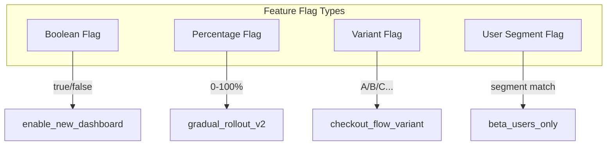
```mermaid
graph TB
    subgraph "Feature Flag Types"
        BOOL[Boolean Flag]
        PCT[Percentage Flag]
        VAR[Variant Flag]
        SEG[User Segment Flag]
    end

    BOOL -->|"true/false"| B_EX["enable_new_dashboard"]
    PCT -->|"0-100%"| P_EX["gradual_rollout_v2"]
    VAR -->|"A/B/C..."| V_EX["checkout_flow_variant"]
    SEG -->|"segment match"| S_EX["beta_users_only"]
```

| Type | Description | Use Case |
|------|-------------|----------|
| **Boolean** | Simple on/off toggle | Kill switch, feature release |
| **Percentage** | Gradual rollout by percentage | Canary releases, load testing |
| **Variant** | Multiple variants (A/B/C testing) | UI experiments, algorithm comparison |
| **User Segment** | Target specific user groups | Beta program, VIP features |

### 2.2 Evaluation Context

The evaluation context contains all information needed to evaluate a flag for a specific request.

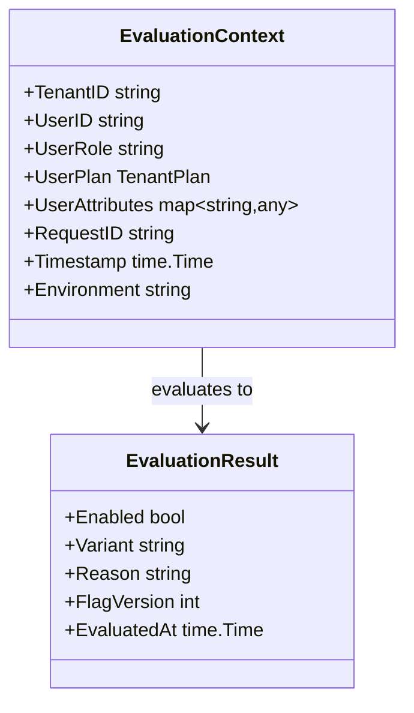
```mermaid
classDiagram
    class EvaluationContext {
        +TenantID string
        +UserID string
        +UserRole string
        +UserPlan TenantPlan
        +UserAttributes map~string,any~
        +RequestID string
        +Timestamp time.Time
        +Environment string
    }

    class EvaluationResult {
        +Enabled bool
        +Variant string
        +Reason string
        +FlagVersion int
        +EvaluatedAt time.Time
    }

    EvaluationContext --> EvaluationResult : evaluates to
```

### 2.3 Override Mechanism (Three-Layer Priority)

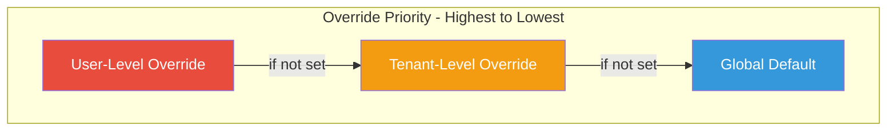
```mermaid
graph TB
    subgraph "Override Priority - Highest to Lowest"
        L1[User-Level Override]
        L2[Tenant-Level Override]
        L3[Global Default]
    end

    L1 -->|"if not set"| L2
    L2 -->|"if not set"| L3

    style L1 fill:#e74c3c,color:#fff
    style L2 fill:#f39c12,color:#fff
    style L3 fill:#3498db,color:#fff
```

| Priority | Level | Description | Example |
|----------|-------|-------------|---------|
| 1 (Highest) | User Override | Per-user flag value | Force beta feature for QA tester |
| 2 | Tenant Override | Per-tenant flag value | Enable feature for enterprise tenant |
| 3 (Lowest) | Global Default | System-wide default | Default disabled for new features |

---

## 3. System Architecture

### 3.1 High-Level Architecture

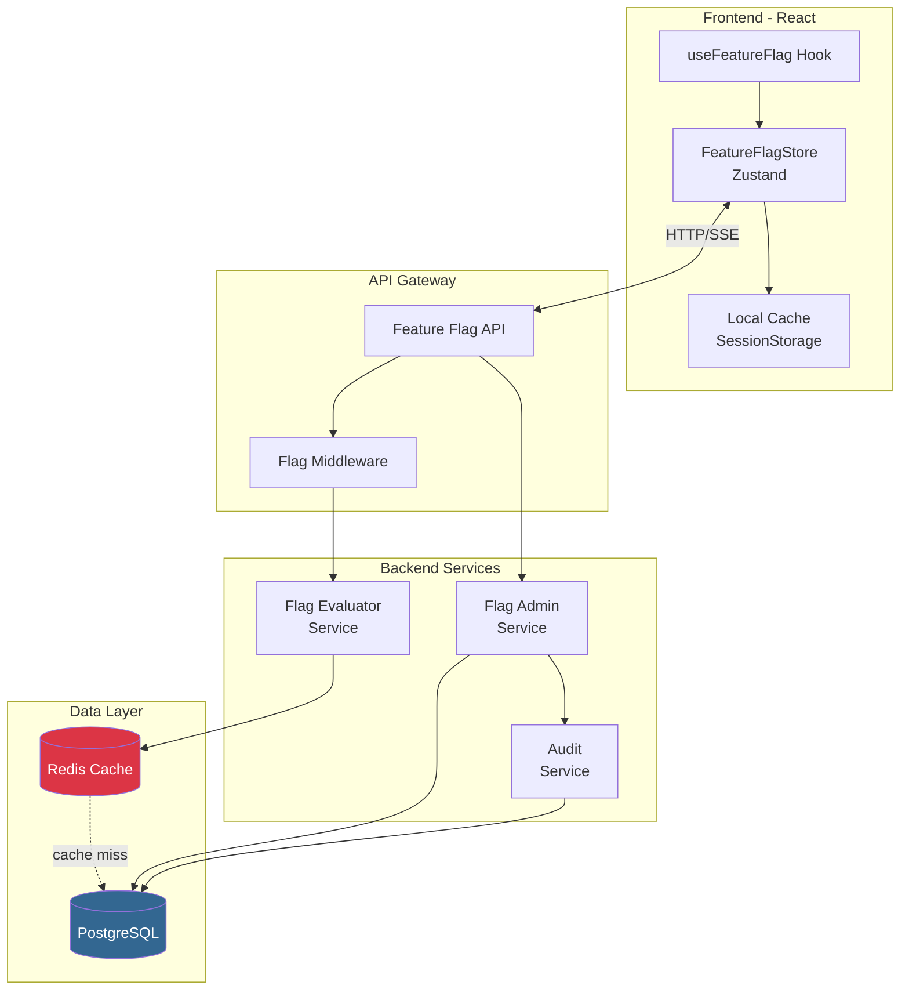
```mermaid
graph TB
    subgraph "Frontend - React"
        FE_HOOK[useFeatureFlag Hook]
        FE_STORE[FeatureFlagStore<br/>Zustand]
        FE_CACHE[Local Cache<br/>SessionStorage]
    end

    subgraph "API Gateway"
        API[Feature Flag API]
        MW[Flag Middleware]
    end

    subgraph "Backend Services"
        EVAL[Flag Evaluator<br/>Service]
        ADMIN[Flag Admin<br/>Service]
        AUDIT[Audit<br/>Service]
    end

    subgraph "Data Layer"
        REDIS[(Redis Cache)]
        PG[(PostgreSQL)]
    end

    FE_HOOK --> FE_STORE
    FE_STORE --> FE_CACHE
    FE_STORE <-->|"HTTP/SSE"| API

    API --> MW
    MW --> EVAL
    API --> ADMIN

    EVAL --> REDIS
    REDIS -.->|"cache miss"| PG
    ADMIN --> PG
    ADMIN --> AUDIT
    AUDIT --> PG

    style REDIS fill:#dc3545,color:#fff
    style PG fill:#336791,color:#fff
```

### 3.2 Component Responsibilities

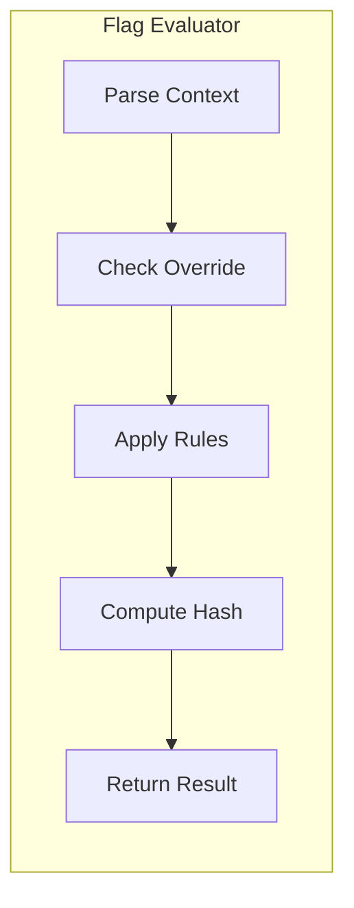
```mermaid
graph LR
    subgraph "Flag Evaluator"
        E1[Parse Context]
        E2[Check Override]
        E3[Apply Rules]
        E4[Compute Hash]
        E5[Return Result]
    end

    E1 --> E2 --> E3 --> E4 --> E5
```

| Component | Responsibility |
|-----------|----------------|
| **Flag Evaluator** | Core evaluation logic, caching, consistency hashing |
| **Flag Admin Service** | CRUD operations, validation, audit logging |
| **Flag Middleware** | Request-level flag injection, performance tracking |
| **FeatureFlagStore (FE)** | Client-side state management, polling/SSE subscription |
| **useFeatureFlag Hook** | React component integration, type-safe access |

### 3.3 Domain Model

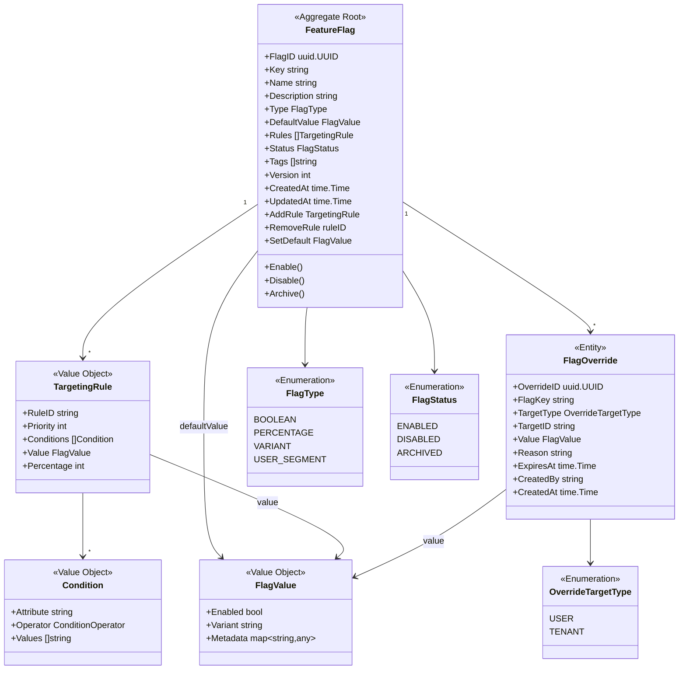
```mermaid
classDiagram
    class FeatureFlag {
        <<Aggregate Root>>
        +FlagID uuid.UUID
        +Key string
        +Name string
        +Description string
        +Type FlagType
        +DefaultValue FlagValue
        +Rules []TargetingRule
        +Status FlagStatus
        +Tags []string
        +Version int
        +CreatedAt time.Time
        +UpdatedAt time.Time
        +Enable()
        +Disable()
        +Archive()
        +AddRule TargetingRule
        +RemoveRule ruleID
        +SetDefault FlagValue
    }

    class FlagOverride {
        <<Entity>>
        +OverrideID uuid.UUID
        +FlagKey string
        +TargetType OverrideTargetType
        +TargetID string
        +Value FlagValue
        +Reason string
        +ExpiresAt time.Time
        +CreatedBy string
        +CreatedAt time.Time
    }

    class TargetingRule {
        <<Value Object>>
        +RuleID string
        +Priority int
        +Conditions []Condition
        +Value FlagValue
        +Percentage int
    }

    class Condition {
        <<Value Object>>
        +Attribute string
        +Operator ConditionOperator
        +Values []string
    }

    class FlagValue {
        <<Value Object>>
        +Enabled bool
        +Variant string
        +Metadata map~string,any~
    }

    class FlagType {
        <<Enumeration>>
        BOOLEAN
        PERCENTAGE
        VARIANT
        USER_SEGMENT
    }

    class FlagStatus {
        <<Enumeration>>
        ENABLED
        DISABLED
        ARCHIVED
    }

    class OverrideTargetType {
        <<Enumeration>>
        USER
        TENANT
    }

    FeatureFlag "1" --> "*" TargetingRule
    FeatureFlag "1" --> "*" FlagOverride
    TargetingRule --> "*" Condition
    FeatureFlag --> FlagValue : defaultValue
    TargetingRule --> FlagValue : value
    FlagOverride --> FlagValue : value
    FeatureFlag --> FlagType
    FeatureFlag --> FlagStatus
    FlagOverride --> OverrideTargetType
```

---

## 4. Data Model Design

### 4.1 ER Diagram

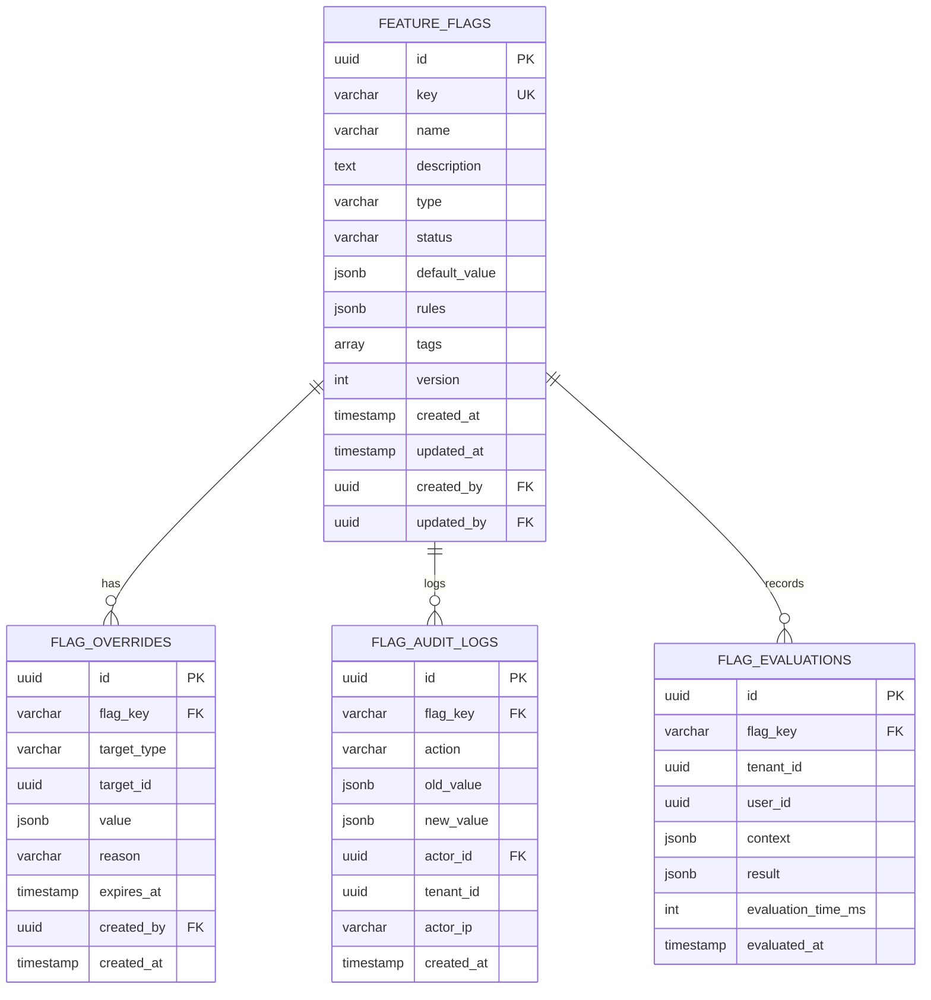
```mermaid
erDiagram
    FEATURE_FLAGS {
        uuid id PK
        varchar key UK
        varchar name
        text description
        varchar type
        varchar status
        jsonb default_value
        jsonb rules
        array tags
        int version
        timestamp created_at
        timestamp updated_at
        uuid created_by FK
        uuid updated_by FK
    }

    FLAG_OVERRIDES {
        uuid id PK
        varchar flag_key FK
        varchar target_type
        uuid target_id
        jsonb value
        varchar reason
        timestamp expires_at
        uuid created_by FK
        timestamp created_at
    }

    FLAG_AUDIT_LOGS {
        uuid id PK
        varchar flag_key FK
        varchar action
        jsonb old_value
        jsonb new_value
        uuid actor_id FK
        uuid tenant_id
        varchar actor_ip
        timestamp created_at
    }

    FLAG_EVALUATIONS {
        uuid id PK
        varchar flag_key FK
        uuid tenant_id
        uuid user_id
        jsonb context
        jsonb result
        int evaluation_time_ms
        timestamp evaluated_at
    }

    FEATURE_FLAGS ||--o{ FLAG_OVERRIDES : "has"
    FEATURE_FLAGS ||--o{ FLAG_AUDIT_LOGS : "logs"
    FEATURE_FLAGS ||--o{ FLAG_EVALUATIONS : "records"
```

### 4.2 Table Specifications

#### feature_flags

| Column | Type | Constraints | Description |
|--------|------|-------------|-------------|
| id | UUID | PK | Primary key |
| key | VARCHAR(100) | UNIQUE, NOT NULL | Flag identifier (e.g., `enable_new_checkout`) |
| name | VARCHAR(200) | NOT NULL | Human-readable name |
| description | TEXT | | Detailed description |
| type | VARCHAR(20) | NOT NULL | `boolean`, `percentage`, `variant`, `user_segment` |
| status | VARCHAR(20) | NOT NULL | `enabled`, `disabled`, `archived` |
| default_value | JSONB | NOT NULL | Default value and metadata |
| rules | JSONB | | Targeting rules array |
| tags | VARCHAR(100)[] | | Searchable tags |
| version | INT | NOT NULL | Optimistic locking version |
| created_at | TIMESTAMP | NOT NULL | Creation time |
| updated_at | TIMESTAMP | NOT NULL | Last update time |
| created_by | UUID | FK | Creator user ID |
| updated_by | UUID | FK | Last updater user ID |

#### flag_overrides

| Column | Type | Constraints | Description |
|--------|------|-------------|-------------|
| id | UUID | PK | Primary key |
| flag_key | VARCHAR(100) | FK, NOT NULL | Reference to feature_flags.key |
| target_type | VARCHAR(20) | NOT NULL | `user` or `tenant` |
| target_id | UUID | NOT NULL | User ID or Tenant ID |
| value | JSONB | NOT NULL | Override value |
| reason | VARCHAR(500) | | Reason for override |
| expires_at | TIMESTAMP | | Auto-expire timestamp |
| created_by | UUID | FK | Creator user ID |
| created_at | TIMESTAMP | NOT NULL | Creation time |

**Indexes:**
```sql
CREATE UNIQUE INDEX idx_flag_overrides_unique
ON flag_overrides(flag_key, target_type, target_id);

CREATE INDEX idx_flag_overrides_target
ON flag_overrides(target_type, target_id);

CREATE INDEX idx_flag_overrides_expires
ON flag_overrides(expires_at)
WHERE expires_at IS NOT NULL;
```

---

## 5. Evaluation Logic

### 5.1 Evaluation Flow Chart

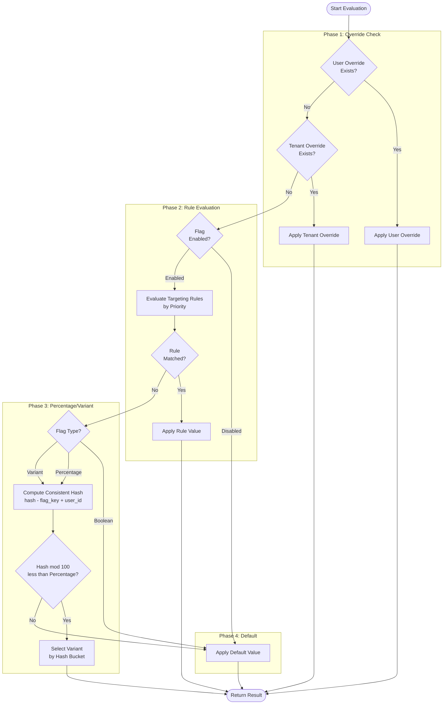
```mermaid
flowchart TB
    START([Start Evaluation])

    subgraph "Phase 1: Override Check"
        CHECK_USER{User Override<br/>Exists?}
        CHECK_TENANT{Tenant Override<br/>Exists?}
        APPLY_USER[Apply User Override]
        APPLY_TENANT[Apply Tenant Override]
    end

    subgraph "Phase 2: Rule Evaluation"
        CHECK_STATUS{Flag<br/>Enabled?}
        EVAL_RULES[Evaluate Targeting Rules<br/>by Priority]
        MATCH_RULE{Rule<br/>Matched?}
        APPLY_RULE[Apply Rule Value]
    end

    subgraph "Phase 3: Percentage/Variant"
        CHECK_TYPE{Flag Type?}
        COMPUTE_HASH[Compute Consistent Hash<br/>hash - flag_key + user_id]
        CHECK_PCT{Hash mod 100<br/>less than Percentage?}
        SELECT_VARIANT[Select Variant<br/>by Hash Bucket]
    end

    subgraph "Phase 4: Default"
        APPLY_DEFAULT[Apply Default Value]
    end

    RESULT([Return Result])

    START --> CHECK_USER
    CHECK_USER -->|Yes| APPLY_USER --> RESULT
    CHECK_USER -->|No| CHECK_TENANT
    CHECK_TENANT -->|Yes| APPLY_TENANT --> RESULT
    CHECK_TENANT -->|No| CHECK_STATUS

    CHECK_STATUS -->|Disabled| APPLY_DEFAULT
    CHECK_STATUS -->|Enabled| EVAL_RULES
    EVAL_RULES --> MATCH_RULE
    MATCH_RULE -->|Yes| APPLY_RULE --> RESULT
    MATCH_RULE -->|No| CHECK_TYPE

    CHECK_TYPE -->|Boolean| APPLY_DEFAULT
    CHECK_TYPE -->|Percentage| COMPUTE_HASH
    CHECK_TYPE -->|Variant| COMPUTE_HASH

    COMPUTE_HASH --> CHECK_PCT
    CHECK_PCT -->|Yes| SELECT_VARIANT --> RESULT
    CHECK_PCT -->|No| APPLY_DEFAULT

    APPLY_DEFAULT --> RESULT
```

### 5.2 Consistent Hashing for Stability

Consistent hashing ensures that a user always receives the same flag value (unless the flag configuration changes), providing a stable experience.

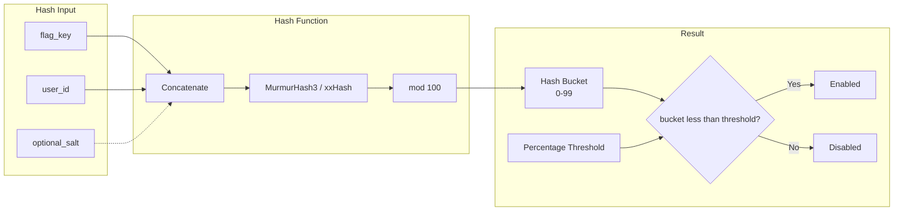
```mermaid
graph LR
    subgraph "Hash Input"
        FK[flag_key]
        UID[user_id]
        SALT[optional_salt]
    end

    subgraph "Hash Function"
        CONCAT[Concatenate]
        HASH[MurmurHash3 / xxHash]
        MOD[mod 100]
    end

    subgraph "Result"
        BUCKET[Hash Bucket<br/>0-99]
        PCT[Percentage Threshold]
        DECISION{bucket less than threshold?}
        ENABLED[Enabled]
        DISABLED[Disabled]
    end

    FK --> CONCAT
    UID --> CONCAT
    SALT -.-> CONCAT
    CONCAT --> HASH --> MOD --> BUCKET
    BUCKET --> DECISION
    PCT --> DECISION
    DECISION -->|Yes| ENABLED
    DECISION -->|No| DISABLED
```

**Hash Function Selection:**

| Algorithm | Speed | Distribution | Recommendation |
|-----------|-------|--------------|----------------|
| MurmurHash3 | Fast | Excellent | **Recommended** |
| xxHash | Fastest | Excellent | Alternative |
| SHA-256 | Slow | Perfect | Overkill |

**Evaluation Pseudocode:**

```
func computeHashBucket(flagKey, userID string) int:
    input = flagKey + ":" + userID
    hash = murmur3.Sum32(input)
    return hash % 100

func isEnabled(flag, ctx) bool:
    bucket = computeHashBucket(flag.Key, ctx.UserID)
    return bucket < flag.Percentage
```

### 5.3 Variant Selection

For A/B/C testing, distribute users across variants using hash buckets:

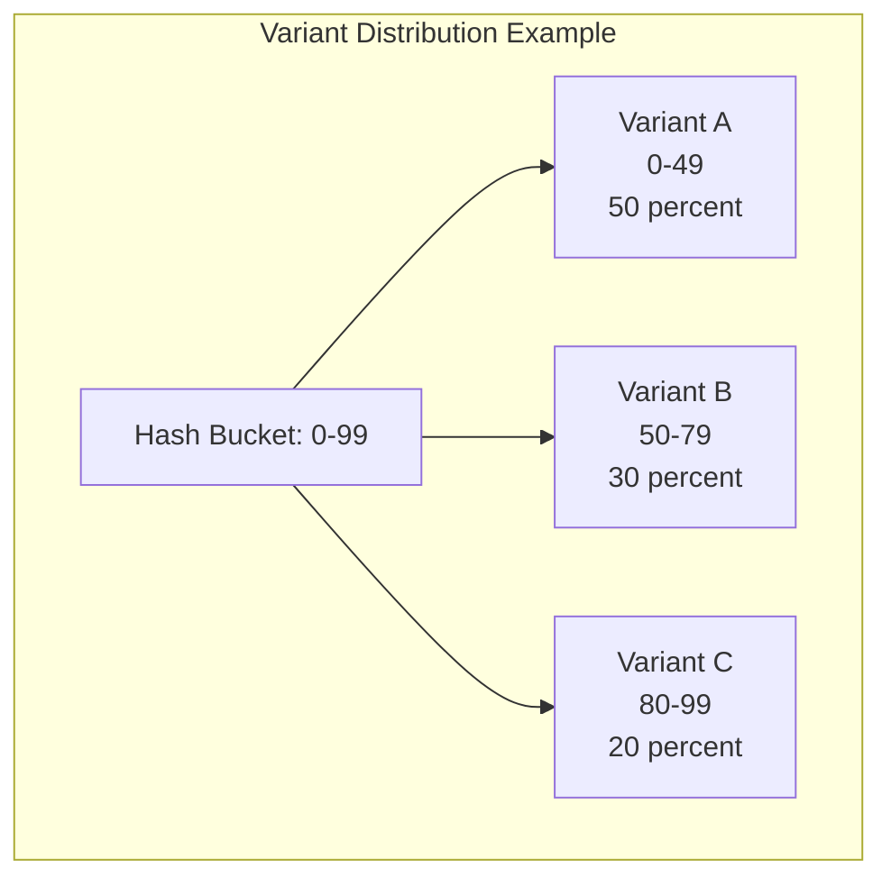
```mermaid
graph TB
    subgraph "Variant Distribution Example"
        HASH[Hash Bucket: 0-99]

        VA[Variant A<br/>0-49<br/>50 percent]
        VB[Variant B<br/>50-79<br/>30 percent]
        VC[Variant C<br/>80-99<br/>20 percent]
    end

    HASH --> VA
    HASH --> VB
    HASH --> VC
```

**Variant Selection Algorithm:**

```
variants = [
  { name: "A", weight: 50 },
  { name: "B", weight: 30 },
  { name: "C", weight: 20 }
]

bucket = hash(flag_key + user_id) % 100
cumulative = 0

for variant in variants:
  cumulative += variant.weight
  if bucket < cumulative:
    return variant.name

return variants[last].name
```

---

## 6. API Design

### 6.1 REST API Endpoints

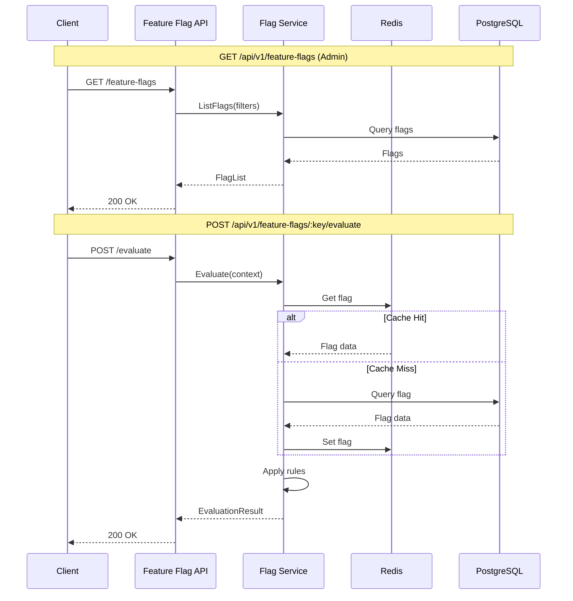
```mermaid
sequenceDiagram
    participant Client
    participant API as Feature Flag API
    participant Service as Flag Service
    participant Cache as Redis
    participant DB as PostgreSQL

    Note over Client,DB: GET /api/v1/feature-flags (Admin)
    Client->>API: GET /feature-flags
    API->>Service: ListFlags(filters)
    Service->>DB: Query flags
    DB-->>Service: Flags
    Service-->>API: FlagList
    API-->>Client: 200 OK

    Note over Client,DB: POST /api/v1/feature-flags/:key/evaluate
    Client->>API: POST /evaluate
    API->>Service: Evaluate(context)
    Service->>Cache: Get flag
    alt Cache Hit
        Cache-->>Service: Flag data
    else Cache Miss
        Service->>DB: Query flag
        DB-->>Service: Flag data
        Service->>Cache: Set flag
    end
    Service->>Service: Apply rules
    Service-->>API: EvaluationResult
    API-->>Client: 200 OK
```

### 6.2 API Specification

#### Flag Management APIs

| Method | Endpoint | Description | Permission |
|--------|----------|-------------|------------|
| GET | `/api/v1/feature-flags` | List all flags | `feature_flag:read` |
| POST | `/api/v1/feature-flags` | Create new flag | `feature_flag:create` |
| GET | `/api/v1/feature-flags/:key` | Get flag details | `feature_flag:read` |
| PUT | `/api/v1/feature-flags/:key` | Update flag | `feature_flag:update` |
| DELETE | `/api/v1/feature-flags/:key` | Archive flag | `feature_flag:delete` |
| POST | `/api/v1/feature-flags/:key/enable` | Enable flag | `feature_flag:update` |
| POST | `/api/v1/feature-flags/:key/disable` | Disable flag | `feature_flag:update` |

#### Evaluation APIs

| Method | Endpoint | Description | Permission |
|--------|----------|-------------|------------|
| POST | `/api/v1/feature-flags/:key/evaluate` | Evaluate single flag | Authenticated |
| POST | `/api/v1/feature-flags/evaluate-batch` | Evaluate multiple flags | Authenticated |
| GET | `/api/v1/feature-flags/client-config` | Get all flags for client | Authenticated |

#### Override APIs

| Method | Endpoint | Description | Permission |
|--------|----------|-------------|------------|
| GET | `/api/v1/feature-flags/:key/overrides` | List overrides | `feature_flag:read` |
| POST | `/api/v1/feature-flags/:key/overrides` | Create override | `feature_flag:override` |
| DELETE | `/api/v1/feature-flags/:key/overrides/:id` | Remove override | `feature_flag:override` |

### 6.3 Request/Response Examples

**Create Flag Request:**
```json
{
  "key": "enable_new_checkout",
  "name": "New Checkout Flow",
  "description": "Enable the redesigned checkout experience",
  "type": "percentage",
  "default_value": {
    "enabled": false,
    "variant": null
  },
  "rules": [
    {
      "priority": 1,
      "conditions": [
        {
          "attribute": "user.plan",
          "operator": "in",
          "values": ["pro", "enterprise"]
        }
      ],
      "value": {
        "enabled": true
      },
      "percentage": 100
    }
  ],
  "tags": ["checkout", "frontend", "experiment"]
}
```

**Evaluate Response:**
```json
{
  "success": true,
  "data": {
    "key": "enable_new_checkout",
    "enabled": true,
    "variant": null,
    "reason": "rule_match",
    "rule_id": "rule_001",
    "flag_version": 5,
    "evaluated_at": "2026-01-27T10:30:00Z"
  }
}
```

**Batch Evaluate Response:**
```json
{
  "success": true,
  "data": {
    "flags": {
      "enable_new_checkout": {
        "enabled": true,
        "variant": null
      },
      "dark_mode_default": {
        "enabled": false,
        "variant": null
      },
      "checkout_variant": {
        "enabled": true,
        "variant": "B"
      }
    },
    "evaluated_at": "2026-01-27T10:30:00Z"
  }
}
```

---

## 7. Frontend Integration

### 7.1 Architecture Overview

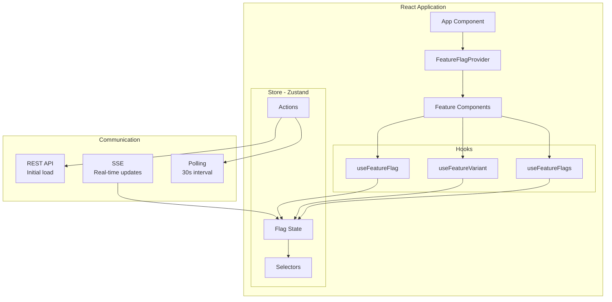
```mermaid
graph TB
    subgraph "React Application"
        APP[App Component]
        PROVIDER[FeatureFlagProvider]
        COMP[Feature Components]

        subgraph "Hooks"
            HOOK1[useFeatureFlag]
            HOOK2[useFeatureVariant]
            HOOK3[useFeatureFlags]
        end

        subgraph "Store - Zustand"
            STATE[Flag State]
            ACTIONS[Actions]
            SELECTORS[Selectors]
        end
    end

    subgraph "Communication"
        POLL[Polling<br/>30s interval]
        SSE[SSE<br/>Real-time updates]
        REST[REST API<br/>Initial load]
    end

    APP --> PROVIDER
    PROVIDER --> COMP
    COMP --> HOOK1
    COMP --> HOOK2
    COMP --> HOOK3

    HOOK1 --> STATE
    HOOK2 --> STATE
    HOOK3 --> STATE

    ACTIONS --> REST
    ACTIONS --> POLL
    SSE --> STATE

    STATE --> SELECTORS
```

### 7.2 Zustand Store Design

```typescript
interface FeatureFlagState {
  // State
  flags: Record<string, FlagValue>;
  isLoading: boolean;
  lastUpdated: Date | null;
  error: string | null;

  // Computed
  isReady: boolean;
}

interface FeatureFlagActions {
  // Actions
  initialize: () => Promise<void>;
  refresh: () => Promise<void>;
  evaluateFlag: (key: string) => FlagValue | null;
  setFlags: (flags: Record<string, FlagValue>) => void;

  // Selectors
  isEnabled: (key: string) => boolean;
  getVariant: (key: string) => string | null;
}

interface FlagValue {
  enabled: boolean;
  variant: string | null;
  metadata?: Record<string, unknown>;
}
```

### 7.3 Hook API

```typescript
// Basic usage
const isEnabled = useFeatureFlag('enable_new_checkout');

// With default value
const isEnabled = useFeatureFlag('enable_new_checkout', false);

// Get variant
const variant = useFeatureVariant('checkout_experiment');

// Get multiple flags
const { enableNewCheckout, darkMode } = useFeatureFlags([
  'enable_new_checkout',
  'dark_mode'
]);

// Conditional rendering component
<Feature flag="enable_new_checkout">
  <NewCheckout />
</Feature>

<Feature flag="enable_new_checkout" fallback={<OldCheckout />}>
  <NewCheckout />
</Feature>
```

### 7.4 Component Integration Pattern

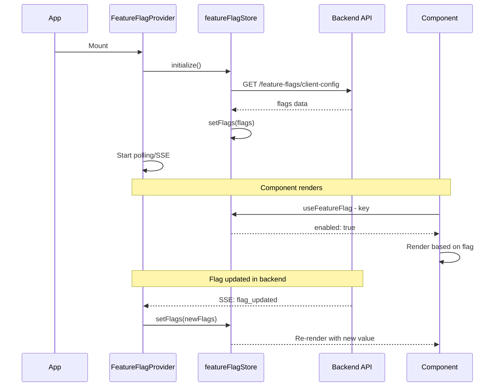
```mermaid
sequenceDiagram
    participant App
    participant Provider as FeatureFlagProvider
    participant Store as featureFlagStore
    participant API as Backend API
    participant Comp as Component

    App->>Provider: Mount
    Provider->>Store: initialize()
    Store->>API: GET /feature-flags/client-config
    API-->>Store: flags data
    Store->>Store: setFlags(flags)
    Provider->>Provider: Start polling/SSE

    Note over Provider,Comp: Component renders

    Comp->>Store: useFeatureFlag - key
    Store-->>Comp: enabled: true
    Comp->>Comp: Render based on flag

    Note over Provider,API: Flag updated in backend

    API-->>Provider: SSE: flag_updated
    Provider->>Store: setFlags(newFlags)
    Store-->>Comp: Re-render with new value
```

---

## 8. Caching Strategy

### 8.1 Multi-Layer Cache Architecture

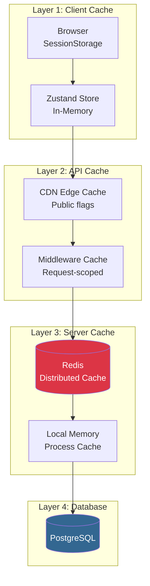
```mermaid
graph TB
    subgraph "Layer 1: Client Cache"
        BROWSER[Browser<br/>SessionStorage]
        ZUSTAND[Zustand Store<br/>In-Memory]
    end

    subgraph "Layer 2: API Cache"
        CDN[CDN Edge Cache<br/>Public flags]
        MIDDLEWARE[Middleware Cache<br/>Request-scoped]
    end

    subgraph "Layer 3: Server Cache"
        REDIS[(Redis<br/>Distributed Cache)]
        LOCAL[Local Memory<br/>Process Cache]
    end

    subgraph "Layer 4: Database"
        PG[(PostgreSQL)]
    end

    BROWSER --> ZUSTAND
    ZUSTAND --> CDN
    CDN --> MIDDLEWARE
    MIDDLEWARE --> REDIS
    REDIS --> LOCAL
    LOCAL --> PG

    style REDIS fill:#dc3545,color:#fff
    style PG fill:#336791,color:#fff
```

### 8.2 Cache Configuration

| Layer | TTL | Invalidation | Use Case |
|-------|-----|--------------|----------|
| Browser SessionStorage | Session | Page refresh | Offline support |
| Zustand Store | N/A (memory) | SSE/Polling | Real-time access |
| Redis | 60 seconds | Pub/Sub | Distributed consistency |
| Local Memory | 10 seconds | TTL | Hot path optimization |

### 8.3 Cache Invalidation Flow

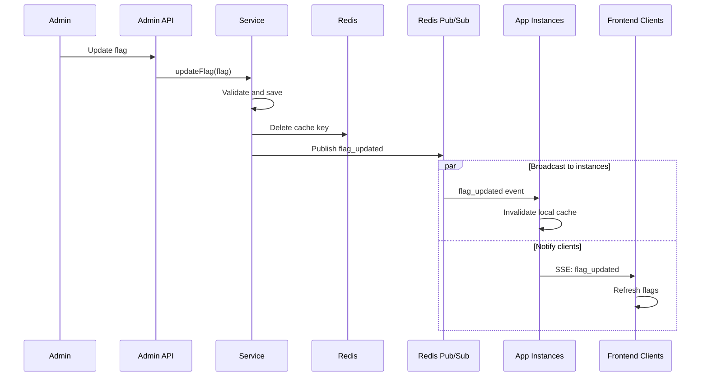
```mermaid
sequenceDiagram
    participant Admin
    participant API as Admin API
    participant Service
    participant Redis
    participant PubSub as Redis Pub/Sub
    participant Instances as App Instances
    participant Clients as Frontend Clients

    Admin->>API: Update flag
    API->>Service: updateFlag(flag)
    Service->>Service: Validate and save
    Service->>Redis: Delete cache key
    Service->>PubSub: Publish flag_updated

    par Broadcast to instances
        PubSub->>Instances: flag_updated event
        Instances->>Instances: Invalidate local cache
    and Notify clients
        Instances->>Clients: SSE: flag_updated
        Clients->>Clients: Refresh flags
    end
```

### 8.4 Redis Key Structure

```
# Flag definition cache
feature_flag:{flag_key} -> JSON flag data
TTL: 60 seconds

# Evaluation result cache (optional, for complex rules)
feature_flag:eval:{flag_key}:{tenant_id}:{user_id_hash} -> JSON result
TTL: 30 seconds

# Override cache
feature_flag:override:{flag_key}:user:{user_id} -> JSON override
feature_flag:override:{flag_key}:tenant:{tenant_id} -> JSON override
TTL: 60 seconds

# Pub/Sub channel
feature_flag:updates
```

---

## 9. Integration with Existing Systems

### 9.1 Integration Points

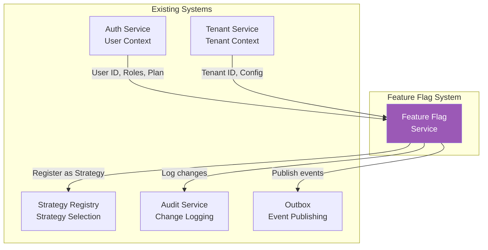
```mermaid
graph TB
    subgraph "Feature Flag System"
        FF[Feature Flag<br/>Service]
    end

    subgraph "Existing Systems"
        AUTH[Auth Service<br/>User Context]
        TENANT[Tenant Service<br/>Tenant Context]
        STRATEGY[Strategy Registry<br/>Strategy Selection]
        AUDIT[Audit Service<br/>Change Logging]
        OUTBOX[Outbox<br/>Event Publishing]
    end

    AUTH -->|"User ID, Roles, Plan"| FF
    TENANT -->|"Tenant ID, Config"| FF
    FF -->|"Register as Strategy"| STRATEGY
    FF -->|"Log changes"| AUDIT
    FF -->|"Publish events"| OUTBOX

    style FF fill:#9b59b6,color:#fff
```

### 9.2 Strategy Registry Integration

The Feature Flag system can be registered as a special strategy type in the existing Strategy Registry:

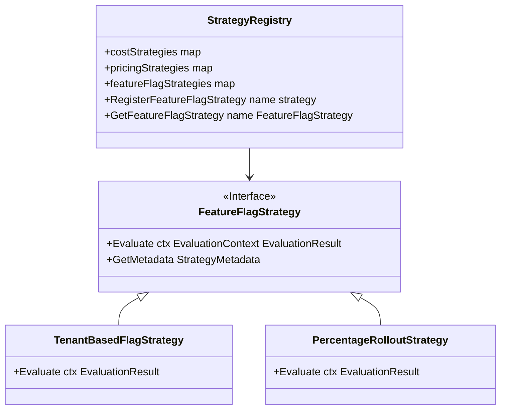
```mermaid
classDiagram
    class StrategyRegistry {
        +costStrategies map
        +pricingStrategies map
        +featureFlagStrategies map
        +RegisterFeatureFlagStrategy name strategy
        +GetFeatureFlagStrategy name FeatureFlagStrategy
    }

    class FeatureFlagStrategy {
        <<Interface>>
        +Evaluate ctx EvaluationContext EvaluationResult
        +GetMetadata StrategyMetadata
    }

    class TenantBasedFlagStrategy {
        +Evaluate ctx EvaluationResult
    }

    class PercentageRolloutStrategy {
        +Evaluate ctx EvaluationResult
    }

    StrategyRegistry --> FeatureFlagStrategy
    FeatureFlagStrategy <|-- TenantBasedFlagStrategy
    FeatureFlagStrategy <|-- PercentageRolloutStrategy
```

### 9.3 Tenant Configuration Extension

Extend the existing `TenantConfig` to include feature flag settings:

```go
type TenantConfig struct {
    // Existing fields...
    MaxUsers      int    `json:"max_users"`
    MaxWarehouses int    `json:"max_warehouses"`

    // Feature Flag extension
    FeatureFlags  string `json:"feature_flags"` // JSON object of tenant-specific flags
    FlagOverrides string `json:"flag_overrides"` // JSON array of override configs
}
```

### 9.4 Middleware Integration

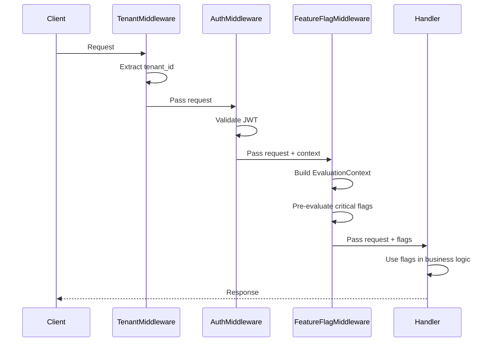
```mermaid
sequenceDiagram
    participant Client
    participant Tenant_MW as TenantMiddleware
    participant Auth_MW as AuthMiddleware
    participant Flag_MW as FeatureFlagMiddleware
    participant Handler

    Client->>Tenant_MW: Request
    Tenant_MW->>Tenant_MW: Extract tenant_id
    Tenant_MW->>Auth_MW: Pass request
    Auth_MW->>Auth_MW: Validate JWT
    Auth_MW->>Flag_MW: Pass request + context

    Flag_MW->>Flag_MW: Build EvaluationContext
    Flag_MW->>Flag_MW: Pre-evaluate critical flags
    Flag_MW->>Handler: Pass request + flags

    Handler->>Handler: Use flags in business logic
    Handler-->>Client: Response
```

---

## 10. Flag Lifecycle

### 10.1 State Diagram

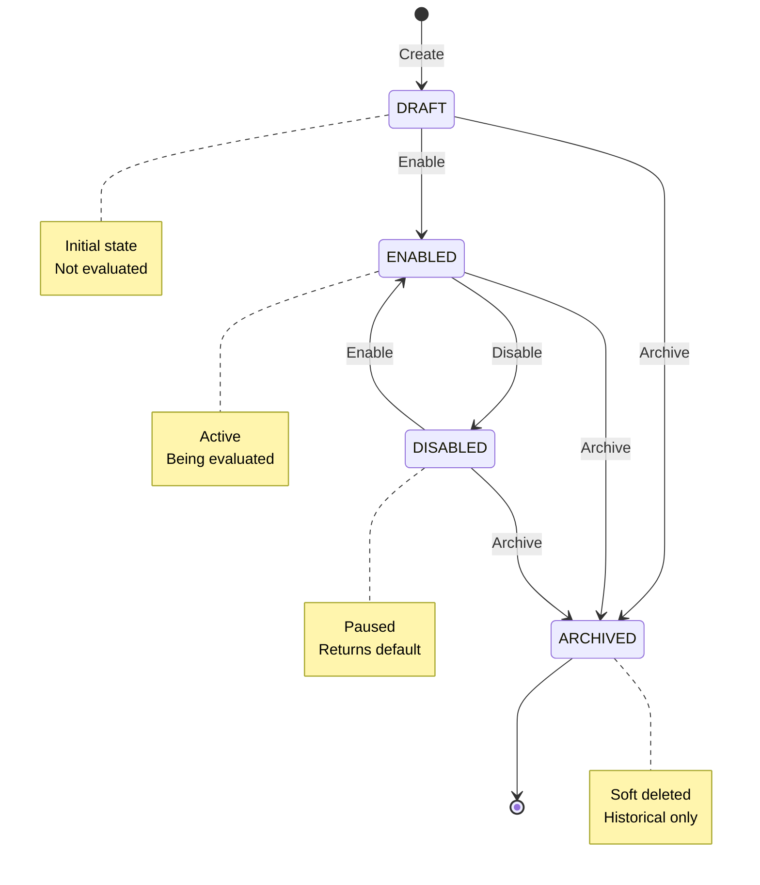
```mermaid
stateDiagram-v2
    [*] --> DRAFT: Create

    DRAFT --> ENABLED: Enable
    DRAFT --> ARCHIVED: Archive

    ENABLED --> DISABLED: Disable
    ENABLED --> ARCHIVED: Archive

    DISABLED --> ENABLED: Enable
    DISABLED --> ARCHIVED: Archive

    ARCHIVED --> [*]

    note right of DRAFT: Initial state<br/>Not evaluated
    note right of ENABLED: Active<br/>Being evaluated
    note right of DISABLED: Paused<br/>Returns default
    note right of ARCHIVED: Soft deleted<br/>Historical only
```

### 10.2 Lifecycle Actions

| State Transition | Trigger | Side Effects |
|-----------------|---------|--------------|
| DRAFT -> ENABLED | Admin enables | Cache populated, evaluations start |
| ENABLED -> DISABLED | Admin disables or kill switch | Cache invalidated, returns default |
| Any -> ARCHIVED | Admin archives | Cache cleared, historical data retained |
| ENABLED (rule change) | Admin updates | Cache invalidated, new rules applied |

### 10.3 Audit Events

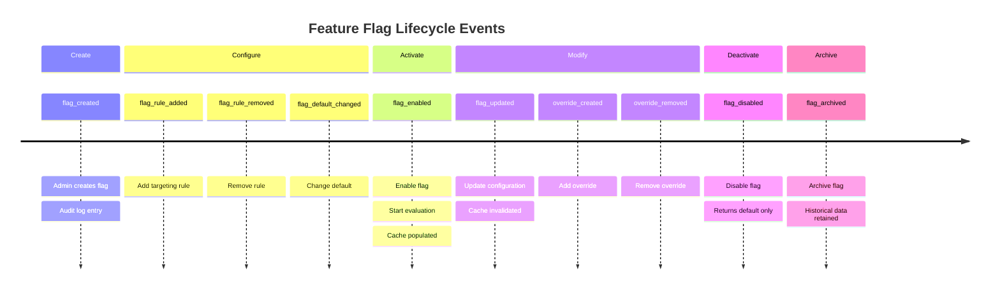
```mermaid
timeline
    title Feature Flag Lifecycle Events

    section Create
        flag_created : Admin creates flag
        : Audit log entry

    section Configure
        flag_rule_added : Add targeting rule
        flag_rule_removed : Remove rule
        flag_default_changed : Change default

    section Activate
        flag_enabled : Enable flag
        : Start evaluation
        : Cache populated

    section Modify
        flag_updated : Update configuration
        : Cache invalidated
        override_created : Add override
        override_removed : Remove override

    section Deactivate
        flag_disabled : Disable flag
        : Returns default only

    section Archive
        flag_archived : Archive flag
        : Historical data retained
```

---

## 11. Security Considerations

### 11.1 Permission Model

| Permission | Description | Roles |
|------------|-------------|-------|
| `feature_flag:read` | View flag configurations | All authenticated |
| `feature_flag:create` | Create new flags | Admin, DevOps |
| `feature_flag:update` | Modify flag settings | Admin, DevOps |
| `feature_flag:delete` | Archive flags | Admin |
| `feature_flag:override` | Create user/tenant overrides | Admin, Support |
| `feature_flag:audit` | View audit logs | Admin, Auditor |

### 11.2 Security Checklist

- [ ] All flag modifications require authentication
- [ ] Audit trail for every flag change
- [ ] Rate limiting on evaluation endpoints
- [ ] Input validation on flag keys and values
- [ ] No sensitive data in flag values or conditions
- [ ] Tenant isolation for overrides
- [ ] Expire override tokens automatically

---

## 12. Implementation Roadmap

### 12.1 Phase Diagram

```mermaid
gantt
    title Feature Flag Implementation Roadmap
    dateFormat  YYYY-MM-DD

    section Phase 1: Foundation
    Database schema and migrations    :p1a, 2026-02-01, 3d
    Core domain model              :p1b, after p1a, 5d
    Basic CRUD API                 :p1c, after p1b, 5d
    Simple boolean evaluation      :p1d, after p1c, 3d

    section Phase 2: Advanced Evaluation
    Percentage rollout             :p2a, after p1d, 3d
    Consistent hashing             :p2b, after p2a, 2d
    Variant selection              :p2c, after p2b, 3d
    Targeting rules                :p2d, after p2c, 5d

    section Phase 3: Caching and Performance
    Redis integration              :p3a, after p2d, 3d
    Cache invalidation             :p3b, after p3a, 2d
    Local memory cache             :p3c, after p3b, 2d

    section Phase 4: Frontend Integration
    Zustand store                  :p4a, after p3c, 3d
    useFeatureFlag hook            :p4b, after p4a, 2d
    Feature component              :p4c, after p4b, 2d
    SSE real-time updates          :p4d, after p4c, 3d

    section Phase 5: Operations
    Admin UI                       :p5a, after p4d, 5d
    Audit logging                  :p5b, after p5a, 3d
    Monitoring and alerts          :p5c, after p5b, 3d
```

### 12.2 Phase Details

#### Phase 1: Foundation (2 weeks)
- Database tables and migrations
- Go domain models (FeatureFlag, FlagOverride)
- Repository interfaces and PostgreSQL implementation
- Basic CRUD endpoints
- Simple boolean flag evaluation

#### Phase 2: Advanced Evaluation (2 weeks)
- Percentage-based rollout with consistent hashing
- Multi-variant A/B testing support
- Targeting rules with conditions
- Override mechanism (user/tenant)

#### Phase 3: Caching and Performance (1 week)
- Redis cache integration
- Pub/Sub for cache invalidation
- Local memory cache with TTL
- Performance benchmarks

#### Phase 4: Frontend Integration (2 weeks)
- Zustand feature flag store
- React hooks (useFeatureFlag, useFeatureVariant)
- Feature component for conditional rendering
- Server-Sent Events for real-time updates
- SessionStorage offline support

#### Phase 5: Operations (2 weeks)
- Admin UI for flag management
- Complete audit logging
- Prometheus metrics
- Alerting for flag changes
- Documentation and training

### 12.3 Success Metrics

| Metric | Target | Measurement |
|--------|--------|-------------|
| Evaluation Latency (p99) | < 5ms | Prometheus histogram |
| Cache Hit Rate | > 95% | Redis metrics |
| Flag Update Propagation | < 5 seconds | E2E test |
| System Availability | 99.9% | Uptime monitoring |

---

## 13. Appendix

### 13.1 Glossary

| Term | Definition |
|------|------------|
| Feature Flag | Configuration that enables/disables features at runtime |
| Targeting Rule | Condition-based rule for flag evaluation |
| Consistent Hash | Hash function ensuring stable distribution |
| Kill Switch | Flag used to quickly disable problematic features |
| Canary Release | Gradual rollout to subset of users |
| A/B Testing | Comparing multiple variants of a feature |

### 13.2 References

- Martin Fowler: Feature Toggles - https://martinfowler.com/articles/feature-toggles.html
- LaunchDarkly Best Practices - https://launchdarkly.com/blog/best-practices-for-feature-flags/
- Consistent Hashing Explained - https://www.toptal.com/big-data/consistent-hashing

### 13.3 Related ADRs

- ADR-002: Feature Flag Storage Selection (PostgreSQL + Redis)
- ADR-003: Hash Algorithm Selection (MurmurHash3)
- ADR-004: Client Sync Strategy (SSE vs WebSocket)
