# 进销存系统 DDD 设计规范书 (Spec)

**版本:** v2.0

**架构模式:** 模块化单体 (Modular Monolith) 或 微服务 (Microservices)

**核心原则:** 围绕业务能力划分边界，统一语言，严格隔离领域层与基础设施层，通过策略模式支持领域扩展。

---

## 1. DDD 核心概念回顾 (Concept Review)

在开始设计前，我们需要对齐以下 DDD 术语，确保开发团队理解一致：

* **统一语言 (Ubiquitous Language):** 业务人员（店主）和开发人员（你）共同使用的语言。代码中的类名、方法名必须与业务术语严格对应（例如：不要叫 `updateTable`, 要叫 `stockIn`）。
* **界限上下文 (Bounded Context):** 系统的逻辑边界。在边界内，概念是统一的。例如，"商品"在 *销售上下文* 中关注价格和促销，而在 *库存上下文* 中关注数量和货位。
* **聚合 (Aggregate) & 聚合根 (Root):** 一组相关对象的集合，作为数据修改的最小单元。**外部对象只能引用聚合根，不能直接修改聚合内部的实体。**
* **实体 (Entity):** 有唯一标识（ID）的对象，其状态会随时间变化（如：订单）。
* **值对象 (Value Object):** 没有唯一标识，通过属性值定义的对象，通常是不可变的（如：地址、金额 `Money`）。
* **领域事件 (Domain Event):** 发生过的、对业务有意义的事情（如：`OrderPlaced`, `PaymentReceived`）。这是解耦不同上下文的关键。
* **领域服务 (Domain Service):** 不属于任何单一实体的业务逻辑，通常涉及多个聚合的协调。
* **端口与适配器 (Ports & Adapters):** 定义抽象接口（Port），具体实现（Adapter）可替换，实现领域层与基础设施的解耦。

---

## 2. 统一语言与术语表 (Ubiquitous Language & Glossary)

这是本系统的"字典"，代码命名必须严格遵循此表。

| **中文业务术语** | **英文代码术语**     | **定义/备注**                                              |
| ---------------------- | -------------------------- | ---------------------------------------------------------------- |
| **货品/商品**    | `Product`                | 商品主数据，包含名称、分类、基础价格等信息                       |
| **最小库存单位** | `SKU`                    | Stock Keeping Unit。本设计中 Product = SKU（如需规格管理可扩展） |
| **商品分类**     | `Category`               | 商品的层级分类                                                   |
| **仓库**         | `Warehouse`              | 库存存放的物理或逻辑位置                                         |
| **供应商**       | `Supplier`               | 采购商品的来源                                                   |
| **客户**         | `Customer`               | 购买商品的对象                                                   |
| **销售订单**     | `SalesOrder`             | 客户购买商品的契约                                               |
| **采购订单**     | `PurchaseOrder`          | 向供应商订货的契约                                               |
| **库存项**       | `InventoryItem`          | 仓库+SKU 维度的库存记录                                          |
| **库存批次**     | `StockBatch`             | 同一 SKU 按入库时间/批号区分的库存                               |
| **库存流水**     | `InventoryTransaction`   | 记录每一次库存变动（不可篡改）                                   |
| **库存锁定**     | `StockLock`              | 预占库存，防止超卖                                               |
| **盘点**         | `StockTaking`            | 核对账面库存与实物库存的过程                                     |
| **应收账款**     | `AccountReceivable`      | 客户欠款                                                         |
| **应付账款**     | `AccountPayable`         | 欠供应商的款项                                                   |
| **收款单**       | `ReceiptVoucher`         | 收到客户付款的凭证                                               |
| **付款单**       | `PaymentVoucher`         | 支付供应商货款的凭证                                             |
| **核销**         | `Reconciliation`         | 将收/付款与应收/应付进行关联抵消                                 |
| **移动加权成本** | `MovingAverageCost`      | 每次入库时重算的成本单价                                         |
| **红冲**         | `Reversal`               | 财务或库存上的负数修正操作                                       |
| **过账**         | `Post`                   | 单据审核通过，正式生效并写入账本                                 |
| **对账单**       | `Statement`              | 定期生成的资金往来汇总（不具备法律效力，仅用于核对）             |
| **发票/单据**    | `Invoice` / `Document` | 具备法律或业务效力的正式凭证                                     |
| **费用**         | `Expense`                | 非交易类支出（房租、水电、工资）                                 |
| **其他收入**     | `OtherIncome`            | 非交易类收入（投资收益、补贴）                                   |
| **现金流量表**   | `CashFlowStatement`      | 汇总所有资金流入流出的报表                                       |

---

## 3. 战略设计：界限上下文划分 (Strategic Design)

系统划分为五个核心界限上下文。上下文之间通过 **领域事件 (Domain Events)** 或 **应用服务调用** 进行交互，禁止直接跨库查询。

### 3.1 上下文地图 (Context Map)

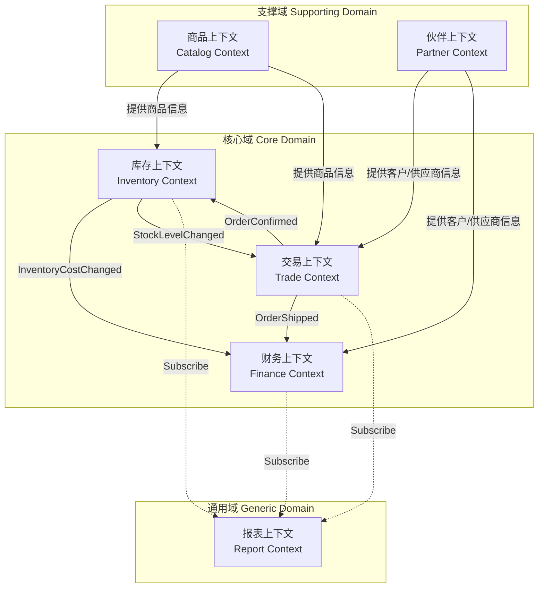
```mermaid
graph TB
    subgraph "核心域 Core Domain"
        INV[库存上下文<br/>Inventory Context]
        TRD[交易上下文<br/>Trade Context]
        FIN[财务上下文<br/>Finance Context]
    end
  
    subgraph "通用域 Generic Domain"
        RPT[报表上下文<br/>Report Context]
    end
  
    subgraph "支撑域 Supporting Domain"
        CAT[商品上下文<br/>Catalog Context]
        PRT[伙伴上下文<br/>Partner Context]
    end
  
    CAT -->|提供商品信息| INV
    CAT -->|提供商品信息| TRD
    PRT -->|提供客户/供应商信息| TRD
    PRT -->|提供客户/供应商信息| FIN
  
    TRD -->|OrderConfirmed| INV
    TRD -->|OrderShipped| FIN
    INV -->|InventoryCostChanged| FIN
    INV -->|StockLevelChanged| TRD
  
    TRD ..->|Subscribe| RPT
    INV ..->|Subscribe| RPT
    FIN ..->|Subscribe| RPT
```

### 3.2 上下文职责

| 上下文               | 职责                                             | 核心聚合                                               |
| -------------------- | ------------------------------------------------ | ------------------------------------------------------ |
| **商品上下文** | 定义"货是什么"：SKU、分类、属性、价格            | `Product`                                            |
| **伙伴上下文** | 管理"跟谁交易"：客户、供应商信息                 | `Customer`, `Supplier`                             |
| **库存上下文** | 管理"货的数量"：库存增减、成本核算、批次         | `InventoryItem`                                      |
| **交易上下文** | 管理"货的流转"：采购、销售订单                   | `SalesOrder`, `PurchaseOrder`                      |
| **财务上下文** | 管理"钱的往来"：应收应付、收付款、核销、日常收支 | `AccountReceivable`, `AccountPayable`, `Expense` |
| **报表上下文** | 管理"数据的统计"：销售报表、库存周转、经营概况   | `SalesReport`, `InventoryStats`                    |

### 3.3 上下文集成模式

| 上游上下文 | 下游上下文 | 集成模式                    | 说明                                     |
| ---------- | ---------- | --------------------------- | ---------------------------------------- |
| 商品       | 库存/交易  | **Open Host Service** | 提供商品查询 API                         |
| 交易       | 库存       | **Domain Event**      | `OrderConfirmed` → 锁定库存           |
| 交易       | 财务       | **Domain Event**      | `OrderShipped` → 生成应收             |
| 库存       | 财务       | **Domain Event**      | `InventoryCostChanged` → 更新存货价值 |

---

## 4. 扩展点设计：策略接口 (Extension Points)

为支持不同行业（农资、建材、食品等）的特殊需求，系统定义以下策略接口：

### 4.1 策略接口定义

```go
package strategy

import (
    "time"
    "github.com/shopspring/decimal"
)

// ============= 结果类型定义 =============

// ValidationResult 校验结果
type ValidationResult struct {
    Valid   bool
    Message string
}

// StockLockResult 锁库存结果
type StockLockResult struct {
    LockID   string
    Quantity decimal.Decimal
    ExpireAt time.Time
}

// AllocationResult 核销分配结果
type AllocationResult struct {
    ReceivableID string
    Amount       Money
}

// BatchSelection 批次选择结果
type BatchSelection struct {
    BatchID  string
    Quantity decimal.Decimal
}

// PricingContext 定价上下文
type PricingContext struct {
    OrderDate   time.Time
    PromotionID *string
}

// ============= 商品校验策略 =============

// ProductValidationStrategy 商品校验策略接口
// 不同行业可能需要特定证照/审批
type ProductValidationStrategy interface {
    // Validate 校验商品是否符合行业要求
    Validate(product *Product) ValidationResult
    // GetRequiredAttributes 获取该行业必填的商品属性
    GetRequiredAttributes() []string
}

// ============= 成本计算策略 =============

// CostCalculationStrategy 成本计算策略接口
type CostCalculationStrategy interface {
    // CalculateUnitCost 计算入库后的单位成本
    CalculateUnitCost(
        currentStock decimal.Decimal,
        currentCost Money,
        incomingQuantity decimal.Decimal,
        incomingCost Money,
    ) Money
}

// MovingAverageCostStrategy 移动加权平均成本（默认）
type MovingAverageCostStrategy struct{}

func (s *MovingAverageCostStrategy) CalculateUnitCost(
    currentStock decimal.Decimal,
    currentCost Money,
    incomingQty decimal.Decimal,
    incomingCost Money,
) Money {
    totalValue := currentStock.Mul(currentCost.Amount()).Add(
        incomingQty.Mul(incomingCost.Amount()),
    )
    totalQty := currentStock.Add(incomingQty)
    if totalQty.IsZero() {
        return NewMoney(decimal.Zero, currentCost.Currency())
    }
    return NewMoney(totalValue.Div(totalQty), currentCost.Currency())
}

// FIFOCostStrategy 先进先出成本（需配合 StockBatch 使用）
type FIFOCostStrategy struct{}

func (s *FIFOCostStrategy) CalculateUnitCost(
    currentStock decimal.Decimal,
    currentCost Money,
    incomingQty decimal.Decimal,
    incomingCost Money,
) Money {
    // FIFO 模式下不重算平均成本，直接返回入库成本
    // 出库时按批次顺序取用
    return incomingCost
}

// ============= 定价策略 =============

// PricingStrategy 销售定价策略接口
type PricingStrategy interface {
    // CalculatePrice 计算销售价格
    CalculatePrice(
        product *Product,
        customer *Customer,
        quantity decimal.Decimal,
        ctx PricingContext,
    ) Money
}

// StandardPricingStrategy 标准定价：直接使用商品售价
type StandardPricingStrategy struct{}

func (s *StandardPricingStrategy) CalculatePrice(
    product *Product,
    customer *Customer,
    quantity decimal.Decimal,
    ctx PricingContext,
) Money {
    return product.SellingPrice
}

// TieredPricingStrategy 阶梯定价：按购买数量分档定价
type TieredPricingStrategy struct {
    Tiers []PriceTier // 价格阶梯，按数量升序排列
}

type PriceTier struct {
    MinQuantity decimal.Decimal
    UnitPrice   Money
}

func (s *TieredPricingStrategy) CalculatePrice(
    product *Product,
    customer *Customer,
    quantity decimal.Decimal,
    ctx PricingContext,
) Money {
    // 从高到低找到适用的阶梯
    for i := len(s.Tiers) - 1; i >= 0; i-- {
        if quantity.GreaterThanOrEqual(s.Tiers[i].MinQuantity) {
            return s.Tiers[i].UnitPrice
        }
    }
    return product.SellingPrice
}

// ============= 核销策略 =============

// PaymentAllocationStrategy 收款核销策略接口
// 决定如何将收款分配到多个应收单
type PaymentAllocationStrategy interface {
    // Allocate 将付款金额分配到应收单
    Allocate(payment Money, receivables []*AccountReceivable) []AllocationResult
}

// FIFOAllocationStrategy 先进先出核销（默认）：按单据日期顺序核销
type FIFOAllocationStrategy struct{}

func (s *FIFOAllocationStrategy) Allocate(
    payment Money,
    receivables []*AccountReceivable,
) []AllocationResult {
    // 按创建时间排序
    sorted := sortByCreatedAt(receivables)
  
    var results []AllocationResult
    remaining := payment.Amount()
  
    for _, r := range sorted {
        if remaining.LessThanOrEqual(decimal.Zero) {
            break
        }
        toAllocate := decimal.Min(remaining, r.OutstandingAmount())
        results = append(results, AllocationResult{
            ReceivableID: r.ID,
            Amount:       NewMoney(toAllocate, payment.Currency()),
        })
        remaining = remaining.Sub(toAllocate)
    }
    return results
}

// ============= 批次管理策略 =============

// BatchManagementStrategy 批次管理策略接口
type BatchManagementStrategy interface {
    // RequiresBatch 判断商品是否需要批次管理
    RequiresBatch(product *Product) bool
    // SelectBatchForOutbound 出库时选择批次
    SelectBatchForOutbound(batches []*StockBatch, quantity decimal.Decimal) []BatchSelection
}

// DefaultBatchStrategy 默认批次策略：不启用批次管理
type DefaultBatchStrategy struct{}

func (s *DefaultBatchStrategy) RequiresBatch(product *Product) bool {
    return false
}

func (s *DefaultBatchStrategy) SelectBatchForOutbound(
    batches []*StockBatch,
    quantity decimal.Decimal,
) []BatchSelection {
    return nil
}

// FIFOBatchStrategy 先进先出批次策略
type FIFOBatchStrategy struct{}

func (s *FIFOBatchStrategy) RequiresBatch(product *Product) bool {
    return true
}

func (s *FIFOBatchStrategy) SelectBatchForOutbound(
    batches []*StockBatch,
    quantity decimal.Decimal,
) []BatchSelection {
    // 按入库时间/效期排序，优先出库早批次
    sorted := sortBatchesByDate(batches)
  
    var selections []BatchSelection
    remaining := quantity
  
    for _, batch := range sorted {
        if remaining.LessThanOrEqual(decimal.Zero) {
            break
        }
        toTake := decimal.Min(remaining, batch.Quantity)
        selections = append(selections, BatchSelection{
            BatchID:  batch.ID,
            Quantity: toTake,
        })
        remaining = remaining.Sub(toTake)
    }
    return selections
}
```

### 4.2 策略注册与使用

```go
package strategy

import "sync"

// StrategyRegistry 策略注册中心（线程安全）
type StrategyRegistry struct {
    mu                  sync.RWMutex
    costStrategies      map[string]CostCalculationStrategy
    pricingStrategies   map[string]PricingStrategy
    allocationStrategies map[string]PaymentAllocationStrategy
    batchStrategies     map[string]BatchManagementStrategy
    productValidators   map[string]ProductValidationStrategy
}

func NewStrategyRegistry() *StrategyRegistry {
    r := &StrategyRegistry{
        costStrategies:      make(map[string]CostCalculationStrategy),
        pricingStrategies:   make(map[string]PricingStrategy),
        allocationStrategies: make(map[string]PaymentAllocationStrategy),
        batchStrategies:     make(map[string]BatchManagementStrategy),
        productValidators:   make(map[string]ProductValidationStrategy),
    }
    // 注册默认策略
    r.RegisterCostStrategy("moving_average", &MovingAverageCostStrategy{})
    r.RegisterPricingStrategy("standard", &StandardPricingStrategy{})
    r.RegisterAllocationStrategy("fifo", &FIFOAllocationStrategy{})
    r.RegisterBatchStrategy("default", &DefaultBatchStrategy{})
    return r
}

func (r *StrategyRegistry) RegisterCostStrategy(name string, s CostCalculationStrategy) {
    r.mu.Lock()
    defer r.mu.Unlock()
    r.costStrategies[name] = s
}

func (r *StrategyRegistry) GetCostStrategy(name string) CostCalculationStrategy {
    r.mu.RLock()
    defer r.mu.RUnlock()
    if s, ok := r.costStrategies[name]; ok {
        return s
    }
    return r.costStrategies["moving_average"]
}

// 其他 Get/Register 方法类似...
```

### 4.3 行业插件机制

```go
package plugin

// IndustryPlugin 行业插件接口
// 通过实现此接口扩展系统以支持特定行业需求
type IndustryPlugin interface {
    // Name 插件唯一标识
    Name() string
    // DisplayName 插件显示名称
    DisplayName() string
    // RegisterStrategies 注册行业特定策略
    RegisterStrategies(registry *StrategyRegistry)
    // GetRequiredProductAttributes 获取行业必填商品属性
    GetRequiredProductAttributes() []AttributeDefinition
}

// AttributeDefinition 商品扩展属性定义
type AttributeDefinition struct {
    Key         string // 属性键，如 "registration_number"
    Label       string // 显示名称，如 "农药登记证号"
    Required    bool   // 是否必填
    Regex       string // 可选的校验正则
}

// PluginManager 插件管理器
type PluginManager struct {
    plugins  map[string]IndustryPlugin
    registry *StrategyRegistry
}

func NewPluginManager(registry *StrategyRegistry) *PluginManager {
    return &PluginManager{
        plugins:  make(map[string]IndustryPlugin),
        registry: registry,
    }
}

func (m *PluginManager) Register(plugin IndustryPlugin) {
    m.plugins[plugin.Name()] = plugin
    plugin.RegisterStrategies(m.registry)
}

func (m *PluginManager) GetPlugin(name string) (IndustryPlugin, bool) {
    p, ok := m.plugins[name]
    return p, ok
}
```

### 4.4 领域服务中使用策略

```go
package inventory

// InventoryDomainService 库存领域服务
type InventoryDomainService struct {
    costStrategy CostCalculationStrategy
    batchStrategy BatchManagementStrategy
}

func NewInventoryDomainService(
    costStrategy CostCalculationStrategy,
    batchStrategy BatchManagementStrategy,
) *InventoryDomainService {
    return &InventoryDomainService{
        costStrategy:  costStrategy,
        batchStrategy: batchStrategy,
    }
}

func (s *InventoryDomainService) StockIn(
    item *InventoryItem,
    quantity decimal.Decimal,
    unitCost Money,
    batchInfo *BatchInfo,
) error {
    newCost := s.costStrategy.CalculateUnitCost(
        item.AvailableQuantity(),
        item.UnitCost(),
        quantity,
        unitCost,
    )
    return item.IncreaseStock(quantity, newCost, batchInfo)
}
```

---

## 5. 战术设计：详细规范 (Tactical Design)

### 5.0 共享内核 (Shared Kernel) - 单据标准化

为统一系统中的"单据"概念，所有涉及业务流转的聚合根（订单、凭证）应遵循统一的元数据规范。

```go
// DocumentMetadata 单据通用元数据
type DocumentMetadata struct {
    ID          string
    DocNo       string    // 业务单号 (如 SO-20231001-001)
    DocType     DocType   // 单据类型
    Status      DocStatus // 通用状态 (DRAFT, APPROVED, VOID, COMPLETED)
    CreatedAt   time.Time
    CreatedBy   UserID
    ApprovedAt  *time.Time
    ApprovedBy  *UserID
    Remarks     string
}

type DocType string

const (
    DocTypeSalesOrder    DocType = "SALES_ORDER"
    DocTypePurchaseOrder DocType = "PURCHASE_ORDER"
    DocTypeReceipt       DocType = "RECEIPT_VOUCHER"
    DocTypePayment       DocType = "PAYMENT_VOUCHER"
    DocTypeStockAdjust   DocType = "STOCK_ADJUST"
    DocTypeExpense       DocType = "EXPENSE_RECORD" // 新增：费用单
)
```

---

### 5.1 商品上下文 (Catalog Context)

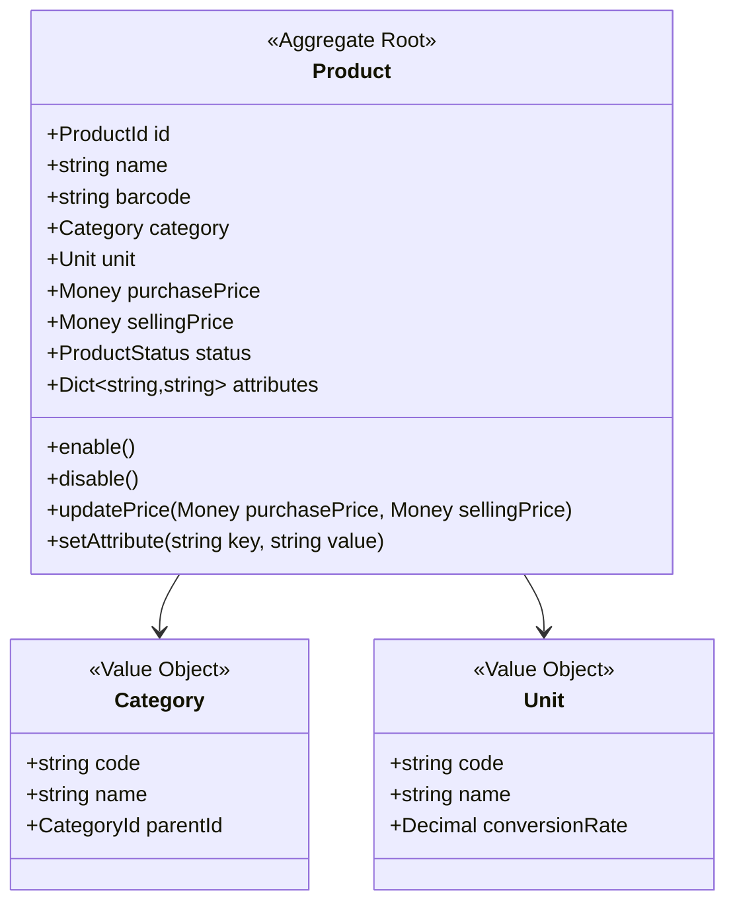
```mermaid
classDiagram
    class Product {
        <<Aggregate Root>>
        +ProductId id
        +string name
        +string barcode
        +Category category
        +Unit unit
        +Money purchasePrice
        +Money sellingPrice
        +ProductStatus status
        +Dict~string,string~ attributes
        +enable()
        +disable()
        +updatePrice(Money purchasePrice, Money sellingPrice)
        +setAttribute(string key, string value)
    }
  
    class Category {
        <<Value Object>>
        +string code
        +string name
        +CategoryId parentId
    }
  
    class Unit {
        <<Value Object>>
        +string code
        +string name
        +Decimal conversionRate
    }
  
    Product --> Category
    Product --> Unit
```

**聚合根:** `Product`

**值对象:**

- `Category`: 商品分类
- `Unit`: 计量单位（支持单位换算）
- `Money`: 金额（含币种）

**行为:**

- `enable()` / `disable()`: 上下架
- `updatePrice()`: 调价
- `setAttribute()`: 设置扩展属性（支持行业特定字段）

**领域事件:**

- `ProductCreated`
- `ProductPriceChanged`
- `ProductDisabled`

---

### 5.2 伙伴上下文 (Partner Context)

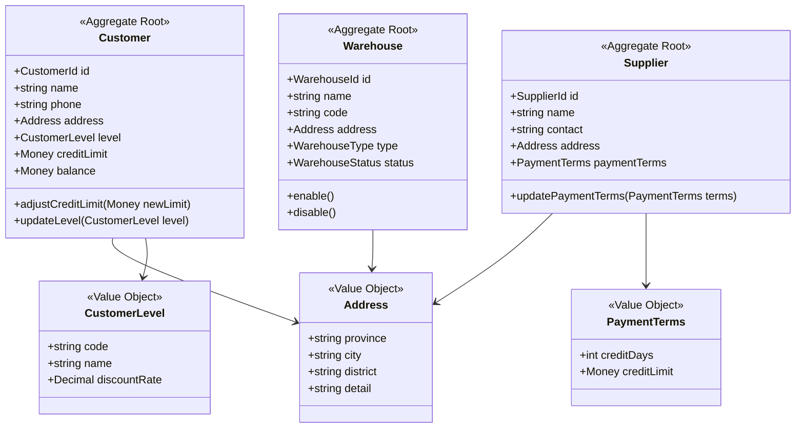
```mermaid
classDiagram
    class Customer {
        <<Aggregate Root>>
        +CustomerId id
        +string name
        +string phone
        +Address address
        +CustomerLevel level
        +Money creditLimit
        +Money balance
        +adjustCreditLimit(Money newLimit)
        +updateLevel(CustomerLevel level)
    }
  
    class Supplier {
        <<Aggregate Root>>
        +SupplierId id
        +string name
        +string contact
        +Address address
        +PaymentTerms paymentTerms
        +updatePaymentTerms(PaymentTerms terms)
    }
  
    class Warehouse {
        <<Aggregate Root>>
        +WarehouseId id
        +string name
        +string code
        +Address address
        +WarehouseType type
        +WarehouseStatus status
        +enable()
        +disable()
    }
  
    class Address {
        <<Value Object>>
        +string province
        +string city
        +string district
        +string detail
    }
  
    class CustomerLevel {
        <<Value Object>>
        +string code
        +string name
        +Decimal discountRate
    }
  
    class PaymentTerms {
        <<Value Object>>
        +int creditDays
        +Money creditLimit
    }
  
    Customer --> Address
    Customer --> CustomerLevel
    Supplier --> Address
    Supplier --> PaymentTerms
    Warehouse --> Address
```

**聚合根:** `Customer`, `Supplier`, `Warehouse`

**说明:**

- `Warehouse`: 仓库可以是实体门店、中心仓、虚拟仓等
- `PaymentTerms`: 账期条款（如30天账期，最高赊账额度）

---

### 5.3 库存上下文 (Inventory Context) — 核心

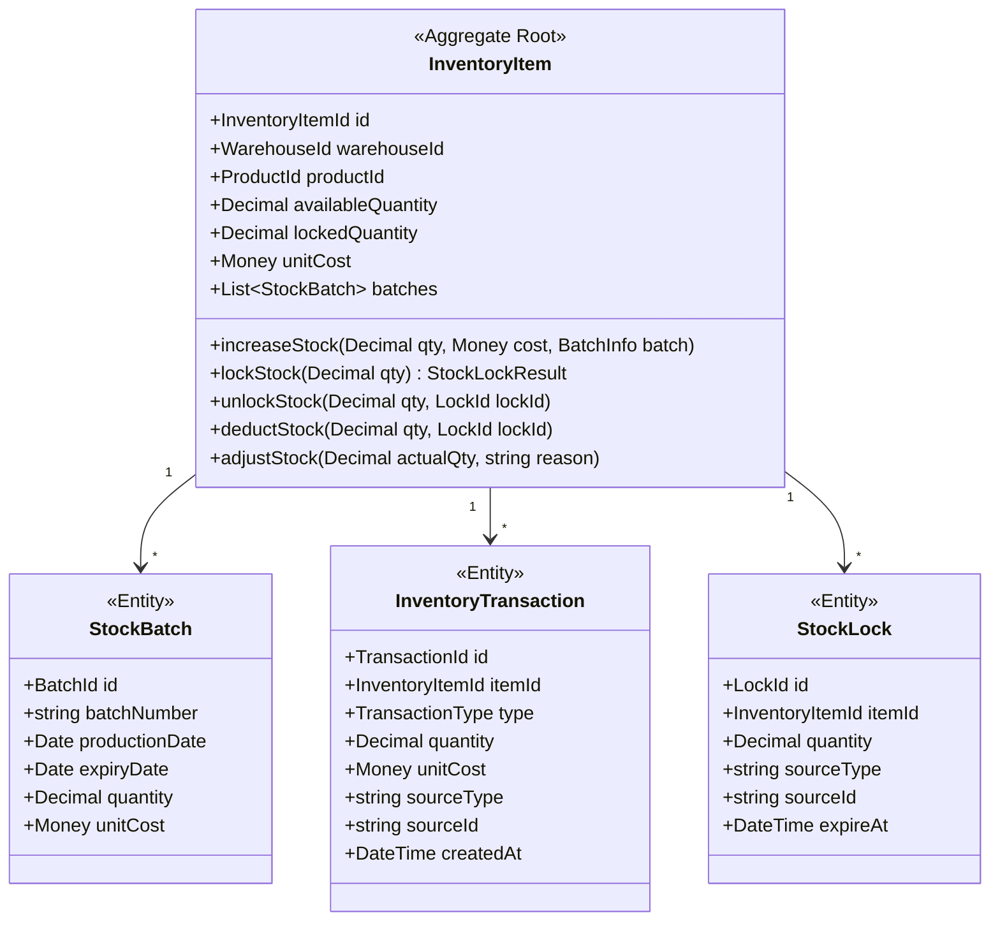
```mermaid
classDiagram
    class InventoryItem {
        <<Aggregate Root>>
        +InventoryItemId id
        +WarehouseId warehouseId
        +ProductId productId
        +Decimal availableQuantity
        +Decimal lockedQuantity
        +Money unitCost
        +List~StockBatch~ batches
        +increaseStock(Decimal qty, Money cost, BatchInfo batch)
        +lockStock(Decimal qty) StockLockResult
        +unlockStock(Decimal qty, LockId lockId)
        +deductStock(Decimal qty, LockId lockId)
        +adjustStock(Decimal actualQty, string reason)
    }
  
    class StockBatch {
        <<Entity>>
        +BatchId id
        +string batchNumber
        +Date productionDate
        +Date expiryDate
        +Decimal quantity
        +Money unitCost
    }
  
    class InventoryTransaction {
        <<Entity>>
        +TransactionId id
        +InventoryItemId itemId
        +TransactionType type
        +Decimal quantity
        +Money unitCost
        +string sourceType
        +string sourceId
        +DateTime createdAt
    }
  
    class StockLock {
        <<Entity>>
        +LockId id
        +InventoryItemId itemId
        +Decimal quantity
        +string sourceType
        +string sourceId
        +DateTime expireAt
    }
  
    InventoryItem "1" --> "*" StockBatch
    InventoryItem "1" --> "*" InventoryTransaction
    InventoryItem "1" --> "*" StockLock
```

**聚合根:** `InventoryItem` (标识: `WarehouseId` + `ProductId`)

**关键行为:**

| 方法                                | 说明           | 触发事件                                     |
| ----------------------------------- | -------------- | -------------------------------------------- |
| `increaseStock(qty, cost, batch)` | 入库，重算成本 | `StockIncreased`, `InventoryCostChanged` |
| `lockStock(qty)`                  | 预占库存       | `StockLocked`                              |
| `unlockStock(qty, lockId)`        | 释放预占       | `StockUnlocked`                            |
| `deductStock(qty, lockId)`        | 实际扣减       | `StockDeducted`                            |
| `adjustStock(actualQty, reason)`  | 盘点调整       | `StockAdjusted`                            |

**不变量 (Invariants):**

- `availableQuantity >= 0`
- `lockedQuantity >= 0`
- `availableQuantity + lockedQuantity == totalQuantity`
- 扣减必须有对应的 Lock

**领域事件:**

- `StockIncreased`: 入库完成
- `StockDeducted`: 出库完成
- `InventoryCostChanged`: 成本变动
- `StockBelowThreshold`: 库存预警

---

### 5.4 交易上下文 (Trade Context)

#### 5.4.1 销售订单

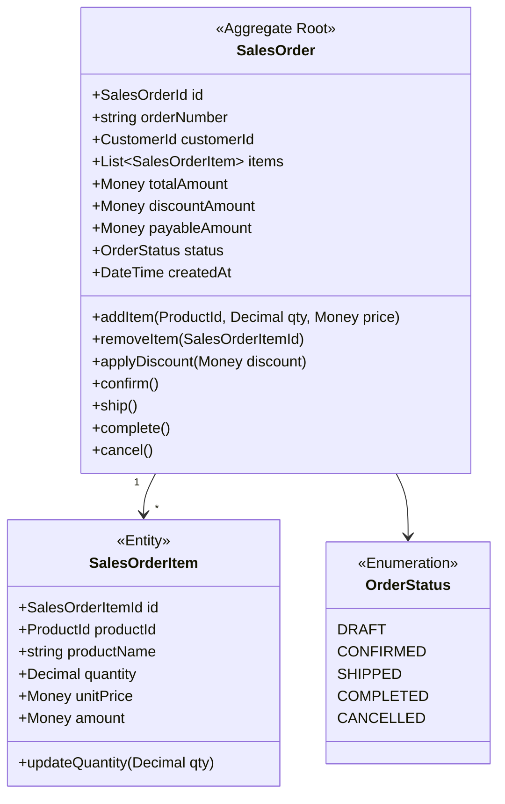
```mermaid
classDiagram
    class SalesOrder {
        <<Aggregate Root>>
        +SalesOrderId id
        +string orderNumber
        +CustomerId customerId
        +List~SalesOrderItem~ items
        +Money totalAmount
        +Money discountAmount
        +Money payableAmount
        +OrderStatus status
        +DateTime createdAt
        +addItem(ProductId, Decimal qty, Money price)
        +removeItem(SalesOrderItemId)
        +applyDiscount(Money discount)
        +confirm()
        +ship()
        +complete()
        +cancel()
    }
  
    class SalesOrderItem {
        <<Entity>>
        +SalesOrderItemId id
        +ProductId productId
        +string productName
        +Decimal quantity
        +Money unitPrice
        +Money amount
        +updateQuantity(Decimal qty)
    }
  
    class OrderStatus {
        <<Enumeration>>
        DRAFT
        CONFIRMED
        SHIPPED
        COMPLETED
        CANCELLED
    }
  
    SalesOrder "1" --> "*" SalesOrderItem
    SalesOrder --> OrderStatus
```

**状态流转:**

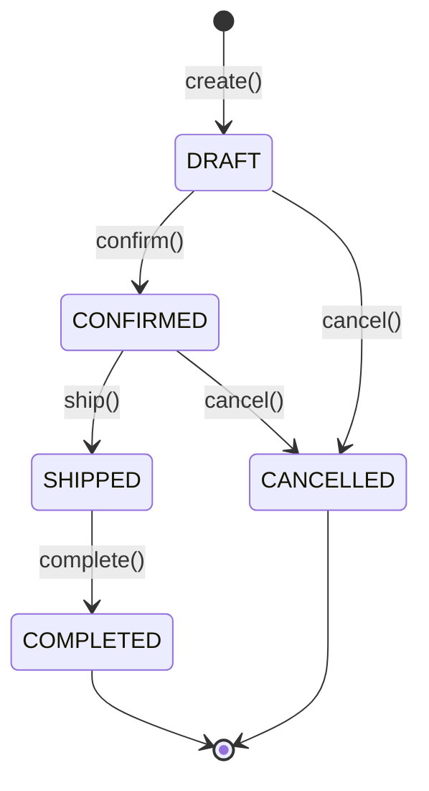
```mermaid
stateDiagram-v2
    [*] --> DRAFT: create()
    DRAFT --> CONFIRMED: confirm()
    DRAFT --> CANCELLED: cancel()
    CONFIRMED --> SHIPPED: ship()
    CONFIRMED --> CANCELLED: cancel()
    SHIPPED --> COMPLETED: complete()
    COMPLETED --> [*]
    CANCELLED --> [*]
```

**关键行为与事件:**

| 方法           | 前置条件              | 副作用       | 触发事件                |
| -------------- | --------------------- | ------------ | ----------------------- |
| `confirm()`  | DRAFT 状态            | -            | `SalesOrderConfirmed` |
| `ship()`     | CONFIRMED, 库存已锁定 | -            | `SalesOrderShipped`   |
| `complete()` | SHIPPED               | -            | `SalesOrderCompleted` |
| `cancel()`   | DRAFT/CONFIRMED       | 释放库存锁定 | `SalesOrderCancelled` |

#### 5.4.2 采购订单

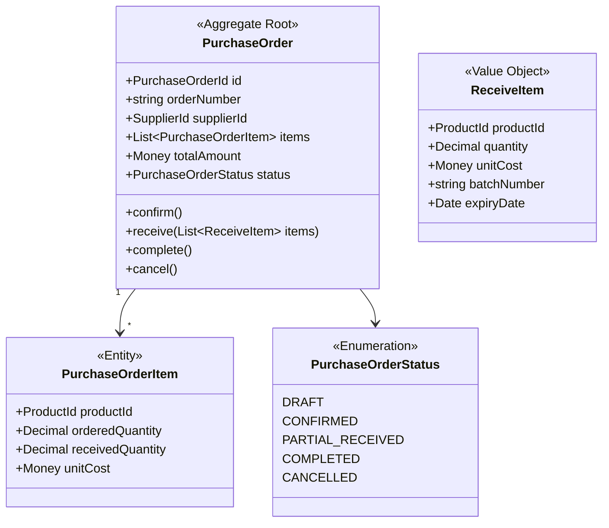
```mermaid
classDiagram
    class PurchaseOrder {
        <<Aggregate Root>>
        +PurchaseOrderId id
        +string orderNumber
        +SupplierId supplierId
        +List~PurchaseOrderItem~ items
        +Money totalAmount
        +PurchaseOrderStatus status
        +confirm()
        +receive(List~ReceiveItem~ items)
        +complete()
        +cancel()
    }
  
    class PurchaseOrderItem {
        <<Entity>>
        +ProductId productId
        +Decimal orderedQuantity
        +Decimal receivedQuantity
        +Money unitCost
    }
  
    class PurchaseOrderStatus {
        <<Enumeration>>
        DRAFT
        CONFIRMED
        PARTIAL_RECEIVED
        COMPLETED
        CANCELLED
    }
  
    class ReceiveItem {
        <<Value Object>>
        +ProductId productId
        +Decimal quantity
        +Money unitCost
        +string batchNumber
        +Date expiryDate
    }
  
    PurchaseOrder "1" --> "*" PurchaseOrderItem
    PurchaseOrder --> PurchaseOrderStatus
```

**状态流转:**

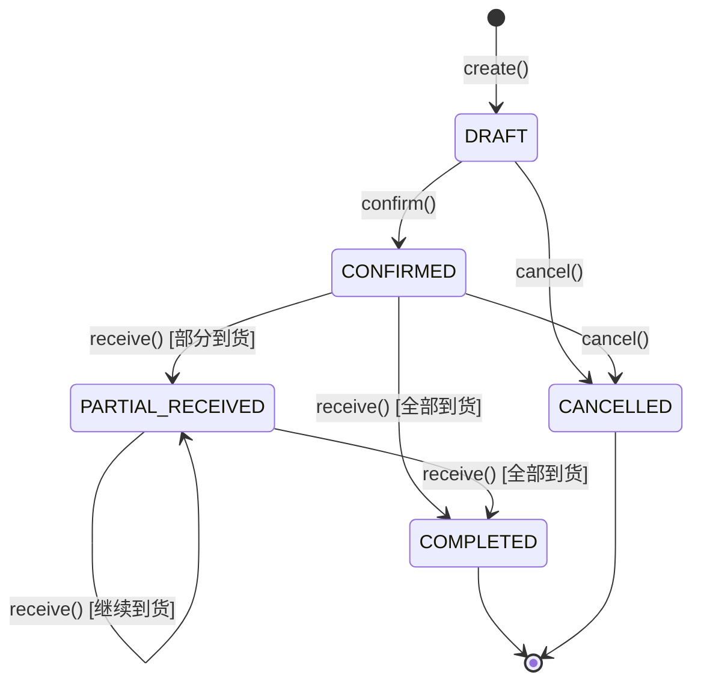
```mermaid
stateDiagram-v2
    [*] --> DRAFT: create()
    DRAFT --> CONFIRMED: confirm()
    DRAFT --> CANCELLED: cancel()
    CONFIRMED --> PARTIAL_RECEIVED: receive() [部分到货]
    CONFIRMED --> COMPLETED: receive() [全部到货]
    CONFIRMED --> CANCELLED: cancel()
    PARTIAL_RECEIVED --> PARTIAL_RECEIVED: receive() [继续到货]
    PARTIAL_RECEIVED --> COMPLETED: receive() [全部到货]
    COMPLETED --> [*]
    CANCELLED --> [*]
```

**关键行为与事件:**

| 方法               | 前置条件                                     | 副作用                              | 触发事件                   |
| ------------------ | -------------------------------------------- | ----------------------------------- | -------------------------- |
| `confirm()`      | DRAFT 状态                                   | -                                   | `PurchaseOrderConfirmed` |
| `receive(items)` | CONFIRMED/PARTIAL_RECEIVED                   | 累加 receivedQuantity，触发库存入库 | `PurchaseOrderReceived`  |
| `complete()`     | 所有明细 receivedQuantity == orderedQuantity | -                                   | `PurchaseOrderCompleted` |
| `cancel()`       | DRAFT/CONFIRMED（未收货）                    | -                                   | `PurchaseOrderCancelled` |

**收货逻辑说明:**

- 每次调用 `receive()` 传入实际收到的商品明细 `[]ReceiveItem`
- 系统校验收货数量不超过订单剩余数量
- 收货后触发 `PurchaseOrderReceived` 事件，库存上下文监听并执行入库
- 当所有明细的 `receivedQuantity >= orderedQuantity` 时自动流转到 `COMPLETED`

---

### 5.5 财务上下文 (Finance Context)

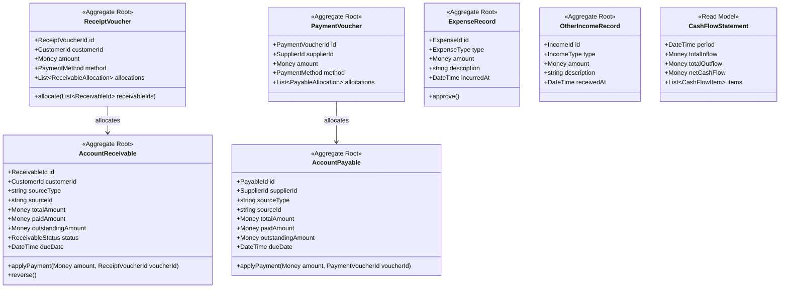
```mermaid
classDiagram
    class AccountReceivable {
        <<Aggregate Root>>
        +ReceivableId id
        +CustomerId customerId
        +string sourceType
        +string sourceId
        +Money totalAmount
        +Money paidAmount
        +Money outstandingAmount
        +ReceivableStatus status
        +DateTime dueDate
        +applyPayment(Money amount, ReceiptVoucherId voucherId)
        +reverse()
    }
  
    class AccountPayable {
        <<Aggregate Root>>
        +PayableId id
        +SupplierId supplierId
        +string sourceType
        +string sourceId
        +Money totalAmount
        +Money paidAmount
        +Money outstandingAmount
        +DateTime dueDate
        +applyPayment(Money amount, PaymentVoucherId voucherId)
    }
  
    class ReceiptVoucher {
        <<Aggregate Root>>
        +ReceiptVoucherId id
        +CustomerId customerId
        +Money amount
        +PaymentMethod method
        +List~ReceivableAllocation~ allocations
        +allocate(List~ReceivableId~ receivableIds)
    }
  
    class PaymentVoucher {
        <<Aggregate Root>>
        +PaymentVoucherId id
        +SupplierId supplierId
        +Money amount
        +PaymentMethod method
        +List~PayableAllocation~ allocations
    }
  
    ReceiptVoucher --> AccountReceivable : allocates
    PaymentVoucher --> AccountPayable : allocates
  
    class ExpenseRecord {
        <<Aggregate Root>>
        +ExpenseId id
        +ExpenseType type
        +Money amount
        +string description
        +DateTime incurredAt
        +approve()
    }
  
    class OtherIncomeRecord {
        <<Aggregate Root>>
        +IncomeId id
        +IncomeType type
        +Money amount
        +string description
        +DateTime receivedAt
    }
  
    class CashFlowStatement {
        <<Read Model>>
        +DateTime period
        +Money totalInflow
        +Money totalOutflow
        +Money netCashFlow
        +List~CashFlowItem~ items
    }
```

**业务说明:**

- **日常收支**: 小企业不仅有进货销货，还有房租、工资、水电等支出（`ExpenseRecord`），以及可能的投资收益或补贴（`OtherIncomeRecord`）。
- **现金流量表**: 需聚合交易类收支（`ReceiptVoucher`/`PaymentVoucher`）和非交易类收支（`Expense`/`OtherIncome`）形成完整的现金流视图。

**领域服务:**

```go
package finance

// ReconciliationService 核销服务
type ReconciliationService struct {
    strategy PaymentAllocationStrategy
}

func NewReconciliationService(strategy PaymentAllocationStrategy) *ReconciliationService {
    return &ReconciliationService{strategy: strategy}
}

// ReconcileReceipt 核销收款单到应收款
func (s *ReconciliationService) ReconcileReceipt(
    voucher *ReceiptVoucher,
    receivables []*AccountReceivable,
) (*ReconciliationResult, error) {
    allocations := s.strategy.Allocate(voucher.Amount(), receivables)
  
    for _, alloc := range allocations {
        receivable := findByID(receivables, alloc.ReceivableID)
        if receivable == nil {
            return nil, ErrReceivableNotFound
        }
        if err := receivable.ApplyPayment(alloc.Amount, voucher.ID()); err != nil {
            return nil, err
        }
    }
  
    voucher.SetAllocations(allocations)
    return &ReconciliationResult{Success: true, Allocations: allocations}, nil
}

// ReconciliationResult 核销结果
type ReconciliationResult struct {
    Success     bool
    Allocations []AllocationResult
}
```

**上下文交互 - 事件处理:**

| 事件                      | 处理                       |
| ------------------------- | -------------------------- |
| `SalesOrderShipped`     | 创建 `AccountReceivable` |
| `PurchaseOrderReceived` | 创建 `AccountPayable`    |
| `InventoryCostChanged`  | 更新存货资产账面价值       |

### 5.6 报表上下文 (Report Context) - 新增

报表上下文负责数据的**统计与分析 (Analytics)**，采用 **CQRS** 模式，将查询模型（Read Model）与业务写入模型（Write Model）分离。

**架构模式:**

- 监听领域事件，异步更新统计表（宽表/OLAP Cube）。
- 或者是定时任务（ETL）从事务库抽取数据到分析库。

**核心统计模型:**

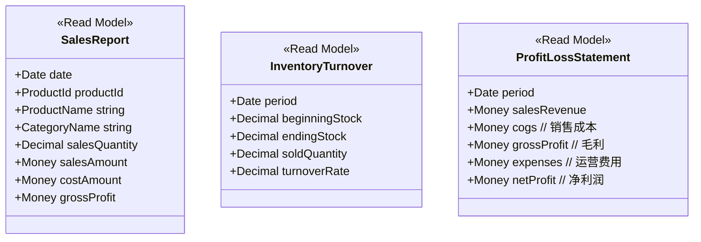
```mermaid
classDiagram
    class SalesReport {
        <<Read Model>>
        +Date date
        +ProductId productId
        +ProductName string
        +CategoryName string
        +Decimal salesQuantity
        +Money salesAmount
        +Money costAmount
        +Money grossProfit
    }
  
    class InventoryTurnover {
        <<Read Model>>
        +Date period
        +Decimal beginningStock
        +Decimal endingStock
        +Decimal soldQuantity
        +Decimal turnoverRate
    }
  
    class ProfitLossStatement {
        <<Read Model>>
        +Date period
        +Money salesRevenue
        +Money cogs            // 销售成本
        +Money grossProfit     // 毛利
        +Money expenses        // 运营费用
        +Money netProfit       // 净利润
    }
```

**API 设计 (Query only):**

- `GET /api/v1/reports/sales/daily?date=2023-10-01`
- `GET /api/v1/reports/products/bestsellers?top=10`
- `GET /api/v1/reports/finance/p-and-l?month=2023-10`

---

## 6. 架构规范与交互流程 (Architecture)

### 6.1 分层架构

```
┌─────────────────────────────────────────────────────────────┐
│                    Interface Layer                          │
│        (Controllers, API Endpoints, DTO, Command)           │
├─────────────────────────────────────────────────────────────┤
│                   Application Layer                         │
│      (Application Services, Use Cases, Event Handlers)      │
├─────────────────────────────────────────────────────────────┤
│                     Domain Layer                            │
│   (Aggregates, Entities, Value Objects, Domain Services,    │
│    Domain Events, Repository Interfaces, Strategy Ports)    │
├─────────────────────────────────────────────────────────────┤
│                  Infrastructure Layer                       │
│  (Repository Impl, DB, Cache, Message Queue, External APIs) │
└─────────────────────────────────────────────────────────────┘
```

**规范:**

- **领域层不依赖**任何基础设施：无数据库、无框架、无外部 API 依赖
- **Application Service** 只做编排：从 Repository 取聚合 → 调用聚合方法 → 保存 → 发布事件
- **Repository 接口**定义在领域层，实现在基础设施层

### 6.2 核心流程示例：销售开单

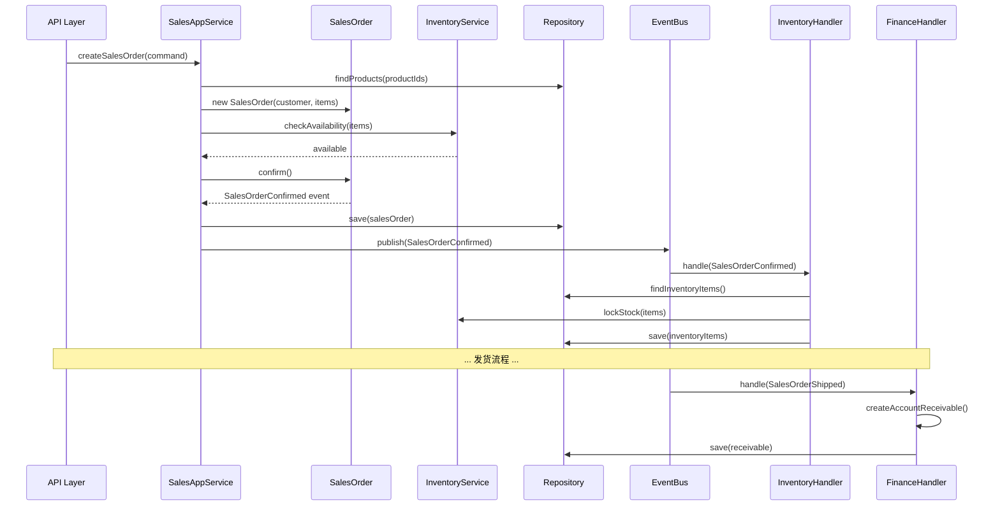
```mermaid
sequenceDiagram
    participant API as API Layer
    participant App as SalesAppService
    participant SO as SalesOrder
    participant Inv as InventoryService
    participant Repo as Repository
    participant Event as EventBus
    participant InvHandler as InventoryHandler
    participant FinHandler as FinanceHandler
  
    API->>App: createSalesOrder(command)
    App->>Repo: findProducts(productIds)
    App->>SO: new SalesOrder(customer, items)
    App->>Inv: checkAvailability(items)
    Inv-->>App: available
    App->>SO: confirm()
    SO-->>App: SalesOrderConfirmed event
    App->>Repo: save(salesOrder)
    App->>Event: publish(SalesOrderConfirmed)
  
    Event->>InvHandler: handle(SalesOrderConfirmed)
    InvHandler->>Repo: findInventoryItems()
    InvHandler->>Inv: lockStock(items)
    InvHandler->>Repo: save(inventoryItems)
  
    Note over API,FinHandler: ... 发货流程 ...
  
    Event->>FinHandler: handle(SalesOrderShipped)
    FinHandler->>FinHandler: createAccountReceivable()
    FinHandler->>Repo: save(receivable)
```

### 6.3 事务边界

| 场景              | 事务范围         | 一致性保证            |
| ----------------- | ---------------- | --------------------- |
| 创建销售订单      | 单个聚合         | 强一致                |
| 确认订单 + 锁库存 | 跨聚合（事件）   | 最终一致              |
| 发货 + 生成应收   | 跨上下文（事件） | 最终一致              |
| 收款核销          | 单上下文多聚合   | 强一致（Saga 或 2PC） |

---

## 7. 风险识别与规避 (Risk Mitigation)

### 7.1 并发库存操作

**风险:** 多个订单同时锁定/扣减同一商品库存，可能超卖。

**规避策略:**

- `InventoryItem` 聚合根级别加**乐观锁**（version 字段）
- 锁库存操作使用 **SELECT FOR UPDATE** 或 Redis 分布式锁
- 批量操作按 `InventoryItemId` 排序后顺序处理，避免死锁

```go
package inventory

import (
    "errors"
    "github.com/shopspring/decimal"
)

var ErrInsufficientStock = errors.New("insufficient stock")

// InventoryItem 库存项聚合根
type InventoryItem struct {
    id                string
    warehouseID       string
    productID         string
    availableQuantity decimal.Decimal
    lockedQuantity    decimal.Decimal
    unitCost          Money
    version           int // 乐观锁版本号
  
    events []DomainEvent
}

// LockStock 锁定库存
func (i *InventoryItem) LockStock(quantity decimal.Decimal, source LockSource) (*StockLockResult, error) {
    if i.availableQuantity.LessThan(quantity) {
        return nil, ErrInsufficientStock
    }
  
    i.availableQuantity = i.availableQuantity.Sub(quantity)
    i.lockedQuantity = i.lockedQuantity.Add(quantity)
  
    lock := &StockLock{
        ID:         NewLockID(),
        ItemID:     i.id,
        Quantity:   quantity,
        SourceType: source.Type,
        SourceID:   source.ID,
        ExpireAt:   time.Now().Add(24 * time.Hour),
    }
  
    i.events = append(i.events, &StockLockedEvent{
        ItemID:   i.id,
        LockID:   lock.ID,
        Quantity: quantity,
    })
  
    return &StockLockResult{
        LockID:   lock.ID,
        Quantity: quantity,
        ExpireAt: lock.ExpireAt,
    }, nil
}

// Version 返回当前版本号，用于乐观锁检查
func (i *InventoryItem) Version() int {
    return i.version
}
```

### 7.2 成本计算时机

**风险:** 采购入库时，如果订单未完整到货，中途计算成本会导致后续批次成本计算错误。

**规避策略:**

- 成本计算在**每次实际入库**时进行
- 采购订单支持**分批收货**，每批独立计算
- 使用 `StockBatch` 记录每批次的独立成本

### 7.3 跨上下文数据一致性

**风险:** 事件丢失或处理失败导致数据不一致。

**规避策略:**

- 使用 **Outbox Pattern**: 事件先写本地 outbox 表，再异步发送
- 事件处理实现**幂等性**
- 定时任务扫描处理失败的事件

```go
package event

import "time"

// OutboxStatus 发件箱状态
type OutboxStatus string

const (
    OutboxStatusPending OutboxStatus = "PENDING"
    OutboxStatusSent    OutboxStatus = "SENT"
    OutboxStatusFailed  OutboxStatus = "FAILED"
)

// OutboxEntry 事件发件箱条目
type OutboxEntry struct {
    ID         string
    EventType  string
    Payload    []byte // JSON 序列化的事件数据
    Status     OutboxStatus
    CreatedAt  time.Time
    RetryCount int
}
```

### 7.4 财务数据准确性

**风险:** 手工修改导致账务不平。

**规避策略:**

- 所有金额变动通过**领域事件**触发，禁止直接修改
- 实现**试算平衡检查** (Trial Balance)
- 关键操作记录完整审计日志

---

## 8. 值对象设计 (Value Objects)

### 8.1 Money（金额）

```go
package valueobject

import (
    "errors"
    "github.com/shopspring/decimal"
)

var ErrCurrencyMismatch = errors.New("currency mismatch")

// Money 金额值对象（不可变）
type Money struct {
    amount   decimal.Decimal
    currency string
}

// NewMoney 创建金额，自动四舍五入到分
func NewMoney(amount decimal.Decimal, currency string) Money {
    return Money{
        amount:   amount.Round(2),
        currency: currency,
    }
}

// NewCNY 创建人民币金额
func NewCNY(amount decimal.Decimal) Money {
    return NewMoney(amount, "CNY")
}

func (m Money) Amount() decimal.Decimal { return m.amount }
func (m Money) Currency() string        { return m.currency }
func (m Money) IsZero() bool            { return m.amount.IsZero() }

// Add 加法
func (m Money) Add(other Money) (Money, error) {
    if m.currency != other.currency {
        return Money{}, ErrCurrencyMismatch
    }
    return NewMoney(m.amount.Add(other.amount), m.currency), nil
}

// Sub 减法
func (m Money) Sub(other Money) (Money, error) {
    if m.currency != other.currency {
        return Money{}, ErrCurrencyMismatch
    }
    return NewMoney(m.amount.Sub(other.amount), m.currency), nil
}

// Mul 乘法
func (m Money) Mul(factor decimal.Decimal) Money {
    return NewMoney(m.amount.Mul(factor), m.currency)
}

// Allocate 按比例分配，解决除不尽的分摊问题
func (m Money) Allocate(ratios []int) []Money {
    total := 0
    for _, r := range ratios {
        total += r
    }
  
    results := make([]Money, len(ratios))
    remainder := m.amount
  
    for i, ratio := range ratios {
        if i == len(ratios)-1 {
            // 最后一份拿剩余，避免精度丢失
            results[i] = NewMoney(remainder, m.currency)
        } else {
            share := m.amount.Mul(decimal.NewFromInt(int64(ratio))).
                Div(decimal.NewFromInt(int64(total))).Round(2)
            results[i] = NewMoney(share, m.currency)
            remainder = remainder.Sub(share)
        }
    }
    return results
}
```

### 8.2 Quantity（数量）

```go
// Quantity 数量值对象（含单位）
type Quantity struct {
    value decimal.Decimal
    unit  string
}

func NewQuantity(value decimal.Decimal, unit string) Quantity {
    return Quantity{value: value, unit: unit}
}

func (q Quantity) Value() decimal.Decimal { return q.value }
func (q Quantity) Unit() string           { return q.unit }

// Add 加法
func (q Quantity) Add(other Quantity) (Quantity, error) {
    if q.unit != other.unit {
        return Quantity{}, errors.New("unit mismatch")
    }
    return NewQuantity(q.value.Add(other.value), q.unit), nil
}

// ConvertTo 单位换算
func (q Quantity) ConvertTo(targetUnit string, conversionRate decimal.Decimal) Quantity {
    return NewQuantity(q.value.Mul(conversionRate), targetUnit)
}
```

---

## 9. API 契约设计 (API Contracts)

### 9.1 通用响应格式

```json
{
  "code": "SUCCESS",       // 业务状态码
  "message": "Operation successful", // 人类可读消息
  "data": { ... },         // 业务数据
  "requestId": "req_..."   // 请求追踪 ID
}
```

**错误响应:**

```json
{
  "code": "INSUFFICIENT_STOCK",
  "message": "库存不足，当前可用: 5",
  "requestId": "req_..."
}
```

### 9.2 商品 API (Product)

```yaml
GET /api/v1/products
Query: 
  keyword: string
  categoryId: string
  status: string
  page: int
  pageSize: int

POST /api/v1/products
Request:
  name: string
  categoryId: string
  unit: string
  purchasePrice: number
  sellingPrice: number
  attributes: object # 行业扩展属性

PUT /api/v1/products/{id}
POST /api/v1/products/{id}/enable
POST /api/v1/products/{id}/disable
```

### 9.3 销售订单 API (Sales Order)

```yaml
# 创建订单
POST /api/v1/sales-orders
Request:
  customerId: string
  items:
    - productId: string
      quantity: number
      unitPrice: number
  remark: string

# 确认订单
POST /api/v1/sales-orders/{orderId}/confirm

# 发货 (扣减库存)
POST /api/v1/sales-orders/{orderId}/ship

# 取消订单
POST /api/v1/sales-orders/{orderId}/cancel
```

### 9.4 采购订单 API (Purchase Order)

```yaml
# 创建采购单
POST /api/v1/purchase-orders
Request:
  supplierId: string
  items:
    - productId: string
      orderedQuantity: number
      unitCost: number

# 确认采购单
POST /api/v1/purchase-orders/{orderId}/confirm

# 采购收货 (触发入库)
POST /api/v1/purchase-orders/{orderId}/receive
Request:
  items:
    - productId: string
      quantity: number
      batchNumber: string # 可选
      expiryDate: date    # 可选
```

### 9.5 库存 API (Inventory)

```yaml
# 查询库存
GET /api/v1/inventory
Query:
  warehouseId: string
  productId: string

# 锁定库存 (通常由订单服务内部调用，但也暴露给外部系统)
POST /api/v1/inventory/lock
Request:
  items:
    - productId: string
      quantity: number
  sourceType: string
  sourceId: string

# 盘点调整
POST /api/v1/inventory/adjust
Request:
  warehouseId: string
  productId: string
  actualQuantity: number
  reason: string
```

### 9.6 财务 API (Finance)

```yaml
# 查询应收账款
GET /api/v1/receivables
Query:
  customerId: string
  status: "UNPAID" | "PARTIAL" | "PAID"

# 创建收款单
POST /api/v1/receipt-vouchers
Request:
  customerId: string
  amount: number
  method: "CASH" | "WECHAT" | "BANK"

# 核销收款
POST /api/v1/receipt-vouchers/{id}/reconcile
Request:
  receivables: # 可选，指定核销哪些单据，不传则按策略自动核销
    - receivableId: string
      amount: number
```

---

## 10. 数据模型 (Data Model)

### 10.1 ER 图

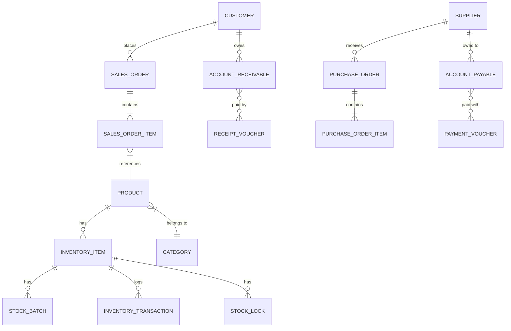
```mermaid
erDiagram
    PRODUCT ||--o{ INVENTORY_ITEM : "has"
    PRODUCT }|--|| CATEGORY : "belongs to"
  
    CUSTOMER ||--o{ SALES_ORDER : "places"
    SALES_ORDER ||--|{ SALES_ORDER_ITEM : "contains"
    SALES_ORDER_ITEM }|--|| PRODUCT : "references"
  
    SUPPLIER ||--o{ PURCHASE_ORDER : "receives"
    PURCHASE_ORDER ||--|{ PURCHASE_ORDER_ITEM : "contains"
  
    INVENTORY_ITEM ||--o{ STOCK_BATCH : "has"
    INVENTORY_ITEM ||--o{ INVENTORY_TRANSACTION : "logs"
    INVENTORY_ITEM ||--o{ STOCK_LOCK : "has"
  
    CUSTOMER ||--o{ ACCOUNT_RECEIVABLE : "owes"
    ACCOUNT_RECEIVABLE }o--o{ RECEIPT_VOUCHER : "paid by"
  
    SUPPLIER ||--o{ ACCOUNT_PAYABLE : "owed to"
    ACCOUNT_PAYABLE }o--o{ PAYMENT_VOUCHER : "paid with"
```

### 10.2 核心表结构

| 表名                       | 说明         | 主键                               |
| -------------------------- | ------------ | ---------------------------------- |
| `products`               | 商品主数据   | `id`                             |
| `categories`             | 商品分类     | `id`                             |
| `customers`              | 客户         | `id`                             |
| `suppliers`              | 供应商       | `id`                             |
| `inventory_items`        | 库存项       | `id` (warehouse_id + product_id) |
| `stock_batches`          | 库存批次     | `id`                             |
| `inventory_transactions` | 库存流水     | `id`                             |
| `stock_locks`            | 库存锁定     | `id`                             |
| `sales_orders`           | 销售订单     | `id`                             |
| `sales_order_items`      | 销售订单明细 | `id`                             |
| `purchase_orders`        | 采购订单     | `id`                             |
| `purchase_order_items`   | 采购订单明细 | `id`                             |
| `account_receivables`    | 应收账款     | `id`                             |
| `account_payables`       | 应付账款     | `id`                             |
| `receipt_vouchers`       | 收款单       | `id`                             |
| `payment_vouchers`       | 付款单       | `id`                             |
| `outbox_events`          | 事件发件箱   | `id`                             |

---

## 11. 下一步建议

1. **定义 API 契约:** 根据上述设计生成完整的 OpenAPI 规范
2. **实现核心聚合:** 先实现 `InventoryItem` 和 `SalesOrder`，编写单元测试
3. **构建事件基础设施:** 实现 Outbox Pattern 和事件总线
4. **实现策略扩展点:** 根据农资场景定制 `ProductValidationStrategy` 等

---

## 附录 A: 领域事件清单

| 上下文 | 事件名                    | 触发时机 | 订阅者                     |
| ------ | ------------------------- | -------- | -------------------------- |
| 商品   | `ProductCreated`        | 商品创建 | 库存（初始化库存项）       |
| 商品   | `ProductPriceChanged`   | 价格调整 | -                          |
| 库存   | `StockIncreased`        | 入库完成 | -                          |
| 库存   | `StockDeducted`         | 出库完成 | -                          |
| 库存   | `InventoryCostChanged`  | 成本变动 | 财务                       |
| 库存   | `StockBelowThreshold`   | 库存预警 | 通知服务                   |
| 交易   | `SalesOrderConfirmed`   | 订单确认 | 库存（锁定）               |
| 交易   | `SalesOrderShipped`     | 订单发货 | 库存（扣减）、财务（应收） |
| 交易   | `SalesOrderCancelled`   | 订单取消 | 库存（释放锁定）           |
| 交易   | `PurchaseOrderReceived` | 采购收货 | 库存（入库）、财务（应付） |
| 财务   | `ReceivableCreated`     | 应收生成 | -                          |
| 财务   | `PaymentReceived`       | 收款完成 | -                          |

---

## 附录 B: 行业扩展示例（农资插件）

以下展示如何通过插件机制支持农资行业特定需求：

```go
package agricultural

import (
    "github.com/your-project/plugin"
    "github.com/your-project/strategy"
)

// AgriculturalPlugin 农资行业插件
type AgriculturalPlugin struct{}

func (p *AgriculturalPlugin) Name() string {
    return "agricultural"
}

func (p *AgriculturalPlugin) DisplayName() string {
    return "农资行业"
}

func (p *AgriculturalPlugin) RegisterStrategies(registry *strategy.StrategyRegistry) {
    // 注册农资商品校验策略
    registry.RegisterProductValidation("agricultural", &AgriculturalProductValidator{})
    // 注册批次管理策略（农药需要批次/效期管理）
    registry.RegisterBatchStrategy("agricultural", &PesticideBatchStrategy{})
}

func (p *AgriculturalPlugin) GetRequiredProductAttributes() []plugin.AttributeDefinition {
    return []plugin.AttributeDefinition{
        {
            Key:      "registration_number",
            Label:    "农药登记证号",
            Required: false, // 仅农药类商品必填
            Regex:    `^PD\d{8}$`,
        },
        {
            Key:      "variety_approval_number",
            Label:    "品种审定编号",
            Required: false, // 仅种子类商品必填
        },
        {
            Key:      "manufacturer",
            Label:    "生产厂家",
            Required: true,
        },
    }
}

// AgriculturalProductValidator 农资商品校验策略
type AgriculturalProductValidator struct{}

func (v *AgriculturalProductValidator) Validate(product *Product) strategy.ValidationResult {
    categoryCode := product.Category.Code
  
    switch categoryCode {
    case "PESTICIDE":
        // 农药必须有登记证号
        regNum := product.Attributes["registration_number"]
        if regNum == "" {
            return strategy.ValidationResult{
                Valid:   false,
                Message: "农药商品必须填写农药登记证号",
            }
        }
    case "SEED":
        // 种子必须有品种审定编号
        approvalNum := product.Attributes["variety_approval_number"]
        if approvalNum == "" {
            return strategy.ValidationResult{
                Valid:   false,
                Message: "种子商品必须填写品种审定编号",
            }
        }
    }
  
    return strategy.ValidationResult{Valid: true}
}

func (v *AgriculturalProductValidator) GetRequiredAttributes() []string {
    return []string{"registration_number", "variety_approval_number", "manufacturer"}
}

// PesticideBatchStrategy 农药批次管理策略
type PesticideBatchStrategy struct{}

func (s *PesticideBatchStrategy) RequiresBatch(product *Product) bool {
    // 农药和种子都需要批次管理
    code := product.Category.Code
    return code == "PESTICIDE" || code == "SEED"
}

func (s *PesticideBatchStrategy) SelectBatchForOutbound(
    batches []*StockBatch,
    quantity decimal.Decimal,
) []strategy.BatchSelection {
    // 优先出库临近过期的批次
    sorted := sortBatchesByExpiryDate(batches)
  
    var selections []strategy.BatchSelection
    remaining := quantity
  
    for _, batch := range sorted {
        // 跳过已过期的批次
        if batch.ExpiryDate.Before(time.Now()) {
            continue
        }
      
        if remaining.LessThanOrEqual(decimal.Zero) {
            break
        }
      
        toTake := decimal.Min(remaining, batch.Quantity)
        selections = append(selections, strategy.BatchSelection{
            BatchID:  batch.ID,
            Quantity: toTake,
        })
        remaining = remaining.Sub(toTake)
    }
  
    return selections
}
```

**使用示例：**

```go
// main.go - 系统初始化时加载农资插件
func main() {
    registry := strategy.NewStrategyRegistry()
    pluginMgr := plugin.NewPluginManager(registry)

    // 注册农资插件
    pluginMgr.Register(&agricultural.AgriculturalPlugin{})

    // 后续业务逻辑中使用相应策略
    productValidator := registry.GetProductValidator("agricultural")
    // ...
}
```

---

## 12. 多租户设计 (Multi-tenancy)

本系统采用**共享数据库 + tenant_id 隔离**的多租户架构，适合中小型 SaaS 部署场景。

### 12.1 租户上下文 (Tenant Context)

租户上下文是一个横切关注点，贯穿所有业务上下文。每个请求都必须携带租户标识。

```mermaid
graph TB
    subgraph "请求流程"
        REQ[HTTP 请求] --> MW[租户中间件]
        MW --> CTX[租户上下文]
        CTX --> BIZ[业务逻辑]
        BIZ --> DB[(数据库)]
    end

    subgraph "租户识别方式"
        H1[Header: X-Tenant-ID]
        H2[JWT Claims: tenant_id]
        H3[子域名: {tenant}.erp.com]
    end

    H1 --> MW
    H2 --> MW
    H3 --> MW
```

### 12.2 Tenant 聚合根设计

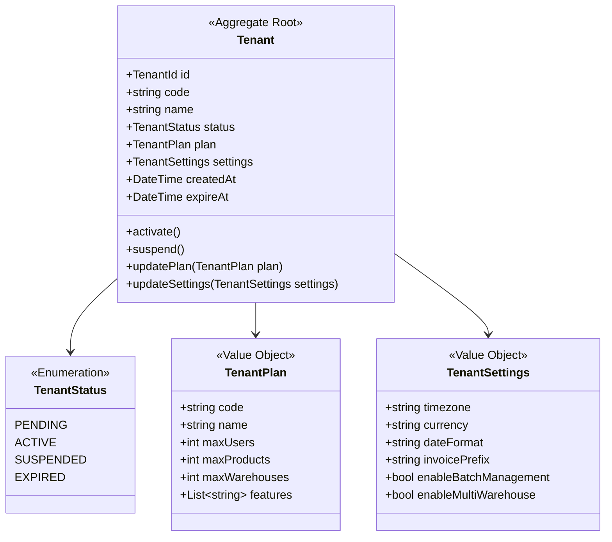
```mermaid
classDiagram
    class Tenant {
        <<Aggregate Root>>
        +TenantId id
        +string code
        +string name
        +TenantStatus status
        +TenantPlan plan
        +TenantSettings settings
        +DateTime createdAt
        +DateTime expireAt
        +activate()
        +suspend()
        +updatePlan(TenantPlan plan)
        +updateSettings(TenantSettings settings)
    }

    class TenantStatus {
        <<Enumeration>>
        PENDING
        ACTIVE
        SUSPENDED
        EXPIRED
    }

    class TenantPlan {
        <<Value Object>>
        +string code
        +string name
        +int maxUsers
        +int maxProducts
        +int maxWarehouses
        +List~string~ features
    }

    class TenantSettings {
        <<Value Object>>
        +string timezone
        +string currency
        +string dateFormat
        +string invoicePrefix
        +bool enableBatchManagement
        +bool enableMultiWarehouse
    }

    Tenant --> TenantStatus
    Tenant --> TenantPlan
    Tenant --> TenantSettings
```

### 12.3 数据隔离策略

| 策略 | 实现方式 | 优点 | 缺点 |
|------|----------|------|------|
| **行级隔离** (采用) | 所有表增加 `tenant_id` 字段 | 成本低、易维护 | 需严格控制 SQL |
| Schema 隔离 | 每租户独立 Schema | 物理隔离更强 | 运维复杂度高 |
| 数据库隔离 | 每租户独立数据库 | 完全隔离 | 成本最高 |

**行级隔离实现要点：**

1. **Repository 自动注入 tenant_id**：所有查询/写入自动附加 tenant_id 条件
2. **数据库约束**：复合唯一索引包含 tenant_id（如 `UNIQUE(tenant_id, order_number)`）
3. **全局查询拦截**：ORM 层面确保不会跨租户查询

### 12.4 租户领域事件

| 事件名 | 触发时机 | 订阅者 |
|--------|----------|--------|
| `TenantCreated` | 租户注册完成 | 初始化服务（创建默认角色、仓库） |
| `TenantActivated` | 租户激活 | 通知服务 |
| `TenantSuspended` | 租户被停用 | 登出所有用户 |
| `TenantPlanChanged` | 套餐变更 | 功能限制服务 |

---

## 13. 身份与权限上下文 (Identity Context)

身份上下文管理用户认证与授权，采用 RBAC (Role-Based Access Control) 模型。

### 13.1 User 聚合根设计

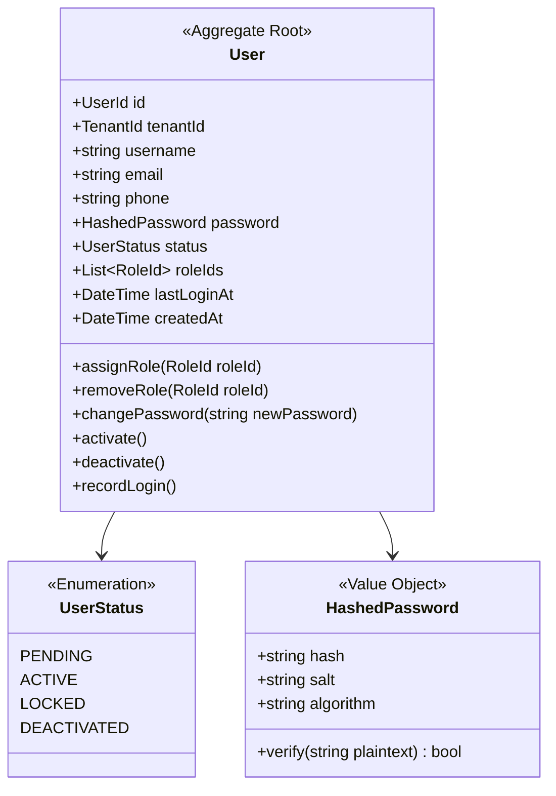
```mermaid
classDiagram
    class User {
        <<Aggregate Root>>
        +UserId id
        +TenantId tenantId
        +string username
        +string email
        +string phone
        +HashedPassword password
        +UserStatus status
        +List~RoleId~ roleIds
        +DateTime lastLoginAt
        +DateTime createdAt
        +assignRole(RoleId roleId)
        +removeRole(RoleId roleId)
        +changePassword(string newPassword)
        +activate()
        +deactivate()
        +recordLogin()
    }

    class UserStatus {
        <<Enumeration>>
        PENDING
        ACTIVE
        LOCKED
        DEACTIVATED
    }

    class HashedPassword {
        <<Value Object>>
        +string hash
        +string salt
        +string algorithm
        +verify(string plaintext) bool
    }

    User --> UserStatus
    User --> HashedPassword
```

### 13.2 Role 聚合根设计

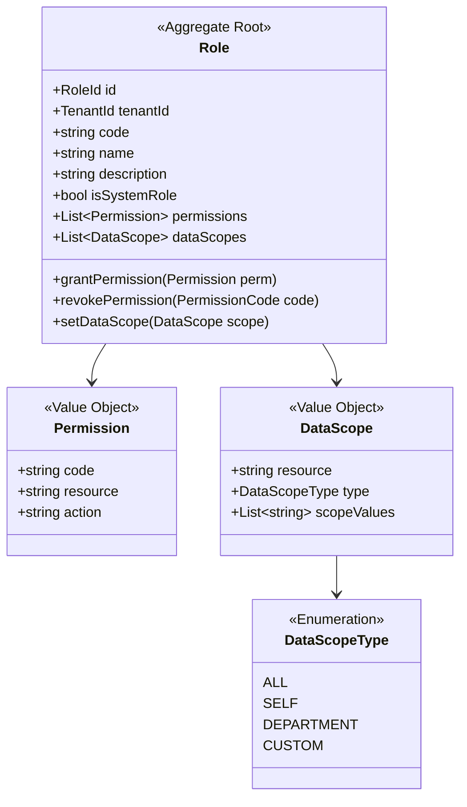
```mermaid
classDiagram
    class Role {
        <<Aggregate Root>>
        +RoleId id
        +TenantId tenantId
        +string code
        +string name
        +string description
        +bool isSystemRole
        +List~Permission~ permissions
        +List~DataScope~ dataScopes
        +grantPermission(Permission perm)
        +revokePermission(PermissionCode code)
        +setDataScope(DataScope scope)
    }

    class Permission {
        <<Value Object>>
        +string code
        +string resource
        +string action
    }

    class DataScope {
        <<Value Object>>
        +string resource
        +DataScopeType type
        +List~string~ scopeValues
    }

    class DataScopeType {
        <<Enumeration>>
        ALL
        SELF
        DEPARTMENT
        CUSTOM
    }

    Role --> Permission
    Role --> DataScope
    DataScope --> DataScopeType
```

### 13.3 权限模型

#### 功能权限 (Functional Permissions)

| 资源 (Resource) | 操作 (Action) | 权限代码 (Code) |
|-----------------|---------------|-----------------|
| `product` | create, read, update, delete | `product:create`, `product:read`, ... |
| `sales_order` | create, read, update, confirm, ship, cancel | `sales_order:confirm`, ... |
| `purchase_order` | create, read, update, confirm, receive, cancel | `purchase_order:receive`, ... |
| `inventory` | read, adjust, lock | `inventory:adjust`, ... |
| `finance` | read, create_receipt, create_payment, reconcile | `finance:reconcile`, ... |
| `report` | view_sales, view_inventory, view_finance | `report:view_finance`, ... |
| `user` | create, read, update, delete, assign_role | `user:assign_role`, ... |
| `role` | create, read, update, delete | `role:create`, ... |

#### 数据权限 (Data Permissions)

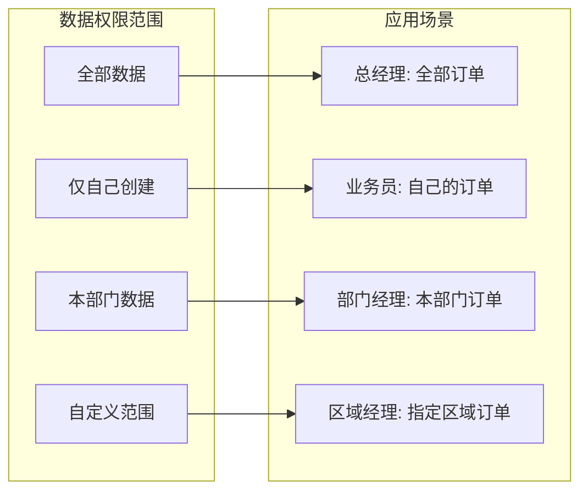
```mermaid
graph LR
    subgraph "数据权限范围"
        ALL[全部数据]
        SELF[仅自己创建]
        DEPT[本部门数据]
        CUSTOM[自定义范围]
    end

    subgraph "应用场景"
        S1[总经理: 全部订单]
        S2[业务员: 自己的订单]
        S3[部门经理: 本部门订单]
        S4[区域经理: 指定区域订单]
    end

    ALL --> S1
    SELF --> S2
    DEPT --> S3
    CUSTOM --> S4
```

### 13.4 预定义角色与权限

| 角色代码 | 角色名称 | 主要权限 | 数据范围 |
|----------|----------|----------|----------|
| `ADMIN` | 系统管理员 | 所有权限 | ALL |
| `OWNER` | 店主/老板 | 除系统配置外所有权限 | ALL |
| `MANAGER` | 店长/经理 | 业务操作 + 报表查看 | ALL |
| `SALES` | 销售员 | 销售订单 + 客户管理 | SELF |
| `PURCHASER` | 采购员 | 采购订单 + 供应商管理 | SELF |
| `WAREHOUSE` | 仓管员 | 库存操作 + 盘点 | ALL (仓库维度) |
| `CASHIER` | 收银员 | 收款 + 销售开单 | SELF |
| `ACCOUNTANT` | 财务 | 财务模块全部权限 | ALL |

### 13.5 授权流程

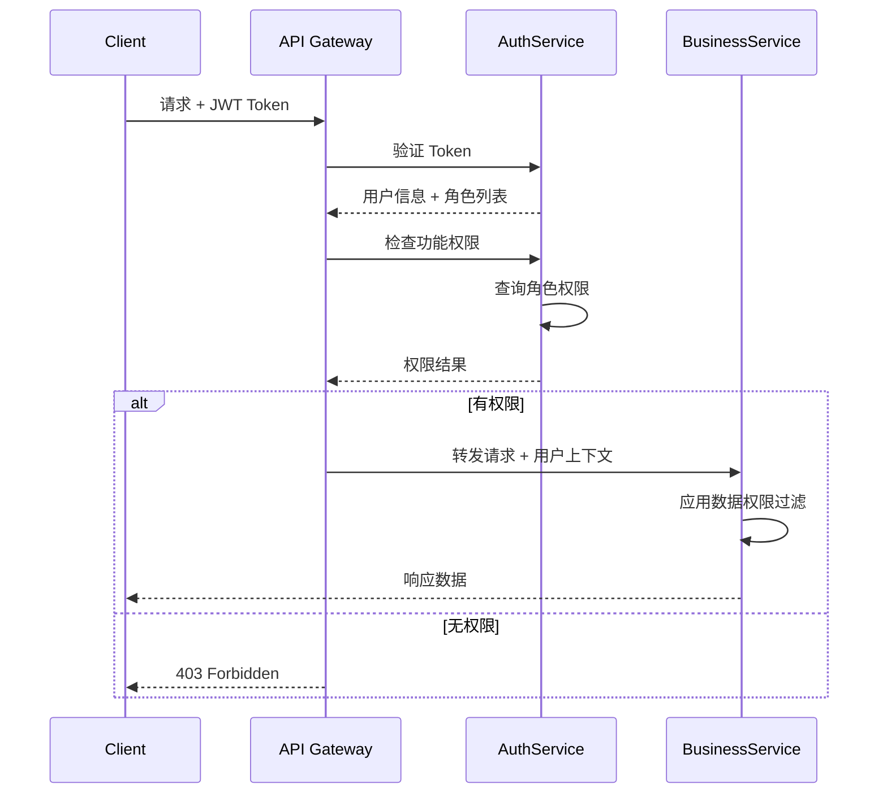
```mermaid
sequenceDiagram
    participant Client
    participant Gateway as API Gateway
    participant Auth as AuthService
    participant Biz as BusinessService

    Client->>Gateway: 请求 + JWT Token
    Gateway->>Auth: 验证 Token
    Auth-->>Gateway: 用户信息 + 角色列表
    Gateway->>Auth: 检查功能权限
    Auth->>Auth: 查询角色权限
    Auth-->>Gateway: 权限结果

    alt 有权限
        Gateway->>Biz: 转发请求 + 用户上下文
        Biz->>Biz: 应用数据权限过滤
        Biz-->>Client: 响应数据
    else 无权限
        Gateway-->>Client: 403 Forbidden
    end
```

### 13.6 身份领域事件

| 事件名 | 触发时机 | 订阅者 |
|--------|----------|--------|
| `UserCreated` | 用户创建 | 通知服务（发送欢迎邮件） |
| `UserRoleAssigned` | 角色分配 | 审计日志 |
| `UserDeactivated` | 用户停用 | 登出服务 |
| `UserPasswordChanged` | 密码修改 | 登出所有会话 |
| `RolePermissionChanged` | 角色权限变更 | 缓存刷新服务 |

### 13.7 API 设计

```yaml
# 用户管理
POST /api/v1/users
GET /api/v1/users
GET /api/v1/users/{id}
PUT /api/v1/users/{id}
POST /api/v1/users/{id}/activate
POST /api/v1/users/{id}/deactivate
POST /api/v1/users/{id}/assign-roles
Request:
  roleIds: string[]

# 角色管理
POST /api/v1/roles
GET /api/v1/roles
GET /api/v1/roles/{id}
PUT /api/v1/roles/{id}
POST /api/v1/roles/{id}/permissions
Request:
  permissions: Permission[]
  dataScopes: DataScope[]

# 认证
POST /api/v1/auth/login
Request:
  username: string
  password: string
Response:
  accessToken: string
  refreshToken: string
  expiresIn: number

POST /api/v1/auth/refresh
POST /api/v1/auth/logout
POST /api/v1/auth/change-password
```

---

## 14. 销售退货 (Sales Return)

销售退货是独立的聚合根，处理客户退货场景，支持完整审批流程。

### 14.1 SalesReturn 聚合根设计

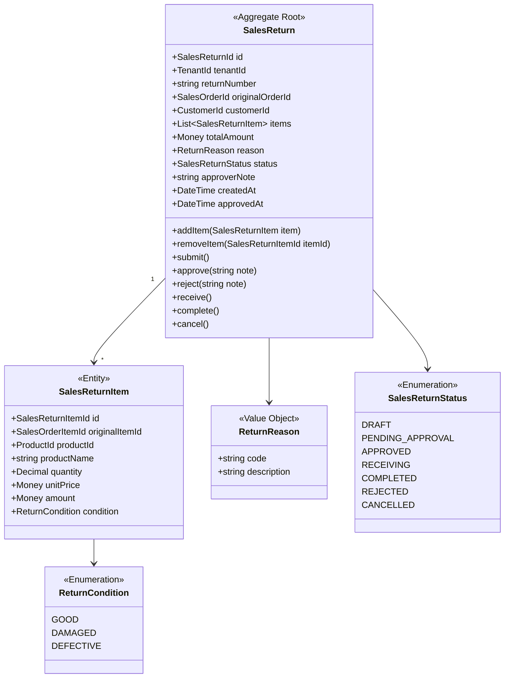
```mermaid
classDiagram
    class SalesReturn {
        <<Aggregate Root>>
        +SalesReturnId id
        +TenantId tenantId
        +string returnNumber
        +SalesOrderId originalOrderId
        +CustomerId customerId
        +List~SalesReturnItem~ items
        +Money totalAmount
        +ReturnReason reason
        +SalesReturnStatus status
        +string approverNote
        +DateTime createdAt
        +DateTime approvedAt
        +addItem(SalesReturnItem item)
        +removeItem(SalesReturnItemId itemId)
        +submit()
        +approve(string note)
        +reject(string note)
        +receive()
        +complete()
        +cancel()
    }

    class SalesReturnItem {
        <<Entity>>
        +SalesReturnItemId id
        +SalesOrderItemId originalItemId
        +ProductId productId
        +string productName
        +Decimal quantity
        +Money unitPrice
        +Money amount
        +ReturnCondition condition
    }

    class ReturnReason {
        <<Value Object>>
        +string code
        +string description
    }

    class ReturnCondition {
        <<Enumeration>>
        GOOD
        DAMAGED
        DEFECTIVE
    }

    class SalesReturnStatus {
        <<Enumeration>>
        DRAFT
        PENDING_APPROVAL
        APPROVED
        RECEIVING
        COMPLETED
        REJECTED
        CANCELLED
    }

    SalesReturn "1" --> "*" SalesReturnItem
    SalesReturn --> ReturnReason
    SalesReturn --> SalesReturnStatus
    SalesReturnItem --> ReturnCondition
```

### 14.2 状态流转

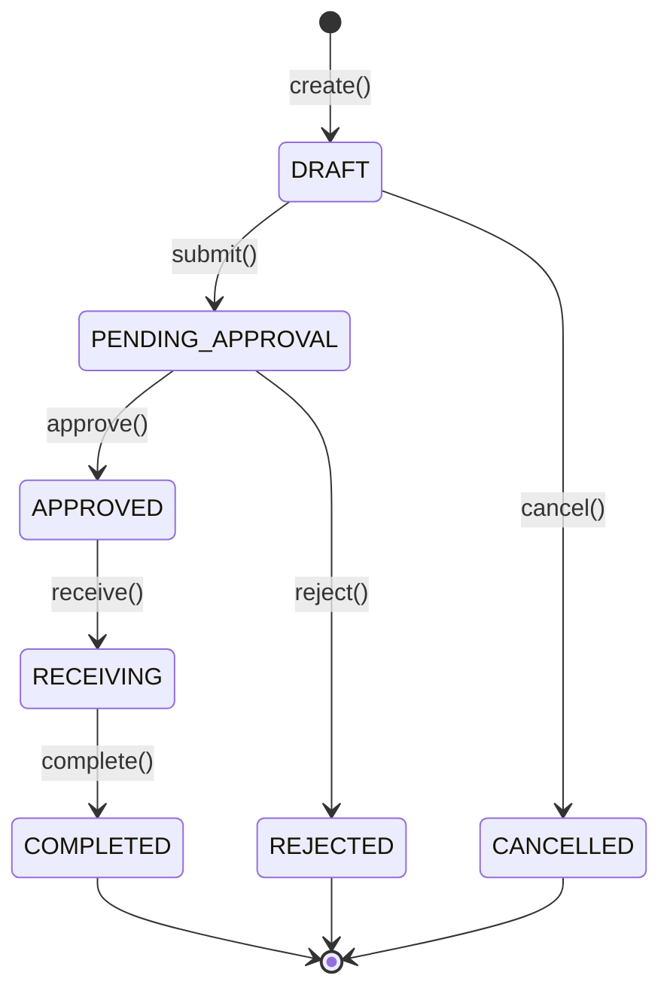
```mermaid
stateDiagram-v2
    [*] --> DRAFT: create()
    DRAFT --> PENDING_APPROVAL: submit()
    DRAFT --> CANCELLED: cancel()

    PENDING_APPROVAL --> APPROVED: approve()
    PENDING_APPROVAL --> REJECTED: reject()

    APPROVED --> RECEIVING: receive()
    RECEIVING --> COMPLETED: complete()

    REJECTED --> [*]
    CANCELLED --> [*]
    COMPLETED --> [*]
```

### 14.3 与销售订单的关系

| 约束 | 说明 |
|------|------|
| 必须关联原单 | `originalOrderId` 必须指向已发货的销售订单 |
| 数量校验 | 退货数量 ≤ 原单已发货数量 - 已退货数量 |
| 价格继承 | 默认继承原单价格，支持调整（如折旧） |
| 部分退货 | 支持单次退部分商品或部分数量 |

### 14.4 关键行为与事件

| 方法 | 前置条件 | 触发事件 |
|------|----------|----------|
| `submit()` | DRAFT 状态，至少一个明细 | `SalesReturnSubmitted` |
| `approve(note)` | PENDING_APPROVAL 状态 | `SalesReturnApproved` |
| `reject(note)` | PENDING_APPROVAL 状态 | `SalesReturnRejected` |
| `receive()` | APPROVED 状态 | `SalesReturnReceiving` |
| `complete()` | RECEIVING 状态，货物已入库 | `SalesReturnCompleted` |

### 14.5 跨上下文交互

```mermaid
sequenceDiagram
    participant SR as SalesReturn
    participant Event as EventBus
    participant Inv as Inventory Handler
    participant Fin as Finance Handler

    SR->>Event: SalesReturnCompleted

    par 库存恢复
        Event->>Inv: handle(SalesReturnCompleted)
        Inv->>Inv: increaseStock(items)
        Note over Inv: 根据 ReturnCondition 决定入库类型<br/>GOOD → 可销售库存<br/>DAMAGED → 残损库存
    and 财务冲销
        Event->>Fin: handle(SalesReturnCompleted)
        Fin->>Fin: createAccountReceivableReversal()
        Note over Fin: 红冲应收账款<br/>如已收款则转为预收款/余额
    end
```

**库存恢复规则：**

| 退货状况 (ReturnCondition) | 库存处理 |
|---------------------------|----------|
| GOOD (完好) | 恢复到可销售库存 |
| DAMAGED (破损) | 进入残损库存，需要报损处理 |
| DEFECTIVE (质量问题) | 进入待退供应商库存 |

**财务冲销规则：**

| 原单状态 | 冲销处理 |
|----------|----------|
| 应收未收 | 红冲应收账款 |
| 部分已收 | 红冲应收 + 退款或转预收 |
| 全部已收 | 全额退款或转客户余额 |

### 14.6 API 设计

```yaml
# 创建退货单
POST /api/v1/sales-returns
Request:
  originalOrderId: string
  customerId: string
  reason:
    code: string
    description: string
  items:
    - originalItemId: string
      productId: string
      quantity: number
      condition: "GOOD" | "DAMAGED" | "DEFECTIVE"

# 提交审批
POST /api/v1/sales-returns/{id}/submit

# 审批通过
POST /api/v1/sales-returns/{id}/approve
Request:
  note: string

# 审批拒绝
POST /api/v1/sales-returns/{id}/reject
Request:
  note: string

# 确认收货
POST /api/v1/sales-returns/{id}/receive

# 完成退货
POST /api/v1/sales-returns/{id}/complete

# 查询退货单
GET /api/v1/sales-returns
Query:
  customerId: string
  status: string
  originalOrderId: string
  startDate: date
  endDate: date
```

---

## 15. 采购退货 (Purchase Return)

采购退货处理向供应商退货的场景，与销售退货流程相似但方向相反。

### 15.1 PurchaseReturn 聚合根设计

```mermaid
classDiagram
    class PurchaseReturn {
        <<Aggregate Root>>
        +PurchaseReturnId id
        +TenantId tenantId
        +string returnNumber
        +PurchaseOrderId originalOrderId
        +SupplierId supplierId
        +List~PurchaseReturnItem~ items
        +Money totalAmount
        +ReturnReason reason
        +PurchaseReturnStatus status
        +string supplierConfirmation
        +DateTime createdAt
        +addItem(PurchaseReturnItem item)
        +submit()
        +approve(string note)
        +ship()
        +confirmBySupplier(string confirmation)
        +complete()
    }

    class PurchaseReturnItem {
        <<Entity>>
        +PurchaseReturnItemId id
        +PurchaseOrderItemId originalItemId
        +ProductId productId
        +string productName
        +Decimal quantity
        +Money unitCost
        +Money amount
        +ReturnCondition condition
    }

    class PurchaseReturnStatus {
        <<Enumeration>>
        DRAFT
        PENDING_APPROVAL
        APPROVED
        SHIPPED
        SUPPLIER_CONFIRMED
        COMPLETED
        REJECTED
        CANCELLED
    }

    PurchaseReturn "1" --> "*" PurchaseReturnItem
    PurchaseReturn --> PurchaseReturnStatus
```

### 15.2 状态流转

```mermaid
stateDiagram-v2
    [*] --> DRAFT: create()
    DRAFT --> PENDING_APPROVAL: submit()
    DRAFT --> CANCELLED: cancel()

    PENDING_APPROVAL --> APPROVED: approve()
    PENDING_APPROVAL --> REJECTED: reject()

    APPROVED --> SHIPPED: ship()
    SHIPPED --> SUPPLIER_CONFIRMED: confirmBySupplier()
    SUPPLIER_CONFIRMED --> COMPLETED: complete()

    REJECTED --> [*]
    CANCELLED --> [*]
    COMPLETED --> [*]
```

**与销售退货的关键差异：**

| 维度 | 销售退货 | 采购退货 |
|------|----------|----------|
| 方向 | 客户 → 我方 | 我方 → 供应商 |
| 库存影响 | 入库（恢复库存） | 出库（减少库存） |
| 财务影响 | 红冲应收 | 红冲应付 |
| 确认方 | 我方确认收货 | 供应商确认收货 |

### 15.3 关键行为与事件

| 方法 | 触发事件 | 说明 |
|------|----------|------|
| `submit()` | `PurchaseReturnSubmitted` | 提交审批 |
| `approve(note)` | `PurchaseReturnApproved` | 审批通过 |
| `ship()` | `PurchaseReturnShipped` | 发货给供应商，触发库存扣减 |
| `confirmBySupplier()` | `PurchaseReturnConfirmed` | 供应商确认收货 |
| `complete()` | `PurchaseReturnCompleted` | 完成，触发应付冲销 |

### 15.4 跨上下文交互

```mermaid
sequenceDiagram
    participant PR as PurchaseReturn
    participant Event as EventBus
    participant Inv as Inventory Handler
    participant Fin as Finance Handler

    PR->>Event: PurchaseReturnShipped
    Event->>Inv: handle(PurchaseReturnShipped)
    Inv->>Inv: deductStock(items)
    Note over Inv: 从库存中扣除退货商品

    PR->>Event: PurchaseReturnCompleted
    Event->>Fin: handle(PurchaseReturnCompleted)
    Fin->>Fin: createAccountPayableReversal()
    Note over Fin: 红冲应付账款<br/>如已付款则记录待收退款
```

### 15.5 API 设计

```yaml
# 创建采购退货单
POST /api/v1/purchase-returns
Request:
  originalOrderId: string
  supplierId: string
  reason:
    code: string
    description: string
  items:
    - originalItemId: string
      productId: string
      quantity: number
      condition: "DEFECTIVE" | "DAMAGED" | "EXPIRED"

# 提交审批
POST /api/v1/purchase-returns/{id}/submit

# 审批
POST /api/v1/purchase-returns/{id}/approve
POST /api/v1/purchase-returns/{id}/reject

# 发货
POST /api/v1/purchase-returns/{id}/ship

# 供应商确认
POST /api/v1/purchase-returns/{id}/supplier-confirm
Request:
  confirmation: string  # 供应商确认单号

# 完成
POST /api/v1/purchase-returns/{id}/complete
```

---

## 16. 多单位支持 (Multi-Unit)

系统支持商品的多计量单位，满足「采购按箱、销售按瓶」的业务需求。

### 16.1 设计原则

| 原则 | 说明 |
|------|------|
| **基础单位** | 每个商品有且仅有一个基础单位，库存以基础单位记录 |
| **交易单位** | 订单明细可使用任意已定义的单位 |
| **自动换算** | 系统自动完成交易单位 → 基础单位的换算 |
| **精度控制** | 换算后数量精度为小数点后 4 位 |

### 16.2 Product 聚合扩展

```mermaid
classDiagram
    class Product {
        <<Aggregate Root>>
        +ProductId id
        +string name
        +Unit baseUnit
        +List~ProductUnit~ alternateUnits
        +addAlternateUnit(ProductUnit unit)
        +removeAlternateUnit(string unitCode)
        +convertToBaseUnit(Decimal qty, string unitCode) Decimal
        +convertFromBaseUnit(Decimal qty, string unitCode) Decimal
    }

    class Unit {
        <<Value Object>>
        +string code
        +string name
    }

    class ProductUnit {
        <<Value Object>>
        +string unitCode
        +string unitName
        +Decimal conversionRate
        +Money defaultPrice
        +bool isDefaultPurchaseUnit
        +bool isDefaultSalesUnit
    }

    Product --> Unit : baseUnit
    Product --> ProductUnit : alternateUnits
```

### 16.3 单位换算规则

**换算公式：**
```
基础单位数量 = 交易单位数量 × 换算率
```

**示例：**

| 商品 | 基础单位 | 交易单位 | 换算率 |
|------|----------|----------|--------|
| 可乐 | 瓶 | 箱 | 24 (1箱=24瓶) |
| 大米 | 千克 | 袋 | 25 (1袋=25kg) |
| 螺丝 | 个 | 盒 | 100 (1盒=100个) |

### 16.4 订单明细中的单位处理

```mermaid
classDiagram
    class SalesOrderItem {
        <<Entity>>
        +SalesOrderItemId id
        +ProductId productId
        +string productName
        +string unitCode
        +string unitName
        +Decimal quantity
        +Decimal baseQuantity
        +Money unitPrice
        +Money amount
    }

    class PurchaseOrderItem {
        <<Entity>>
        +PurchaseOrderItemId id
        +ProductId productId
        +string unitCode
        +Decimal orderedQuantity
        +Decimal orderedBaseQuantity
        +Decimal receivedQuantity
        +Decimal receivedBaseQuantity
        +Money unitCost
    }
```

**处理流程：**

```mermaid
sequenceDiagram
    participant User
    participant Order as OrderService
    participant Product as ProductService

    User->>Order: 添加明细(productId, qty=2, unit="箱")
    Order->>Product: 获取换算率(productId, "箱")
    Product-->>Order: conversionRate=24
    Order->>Order: baseQty = 2 × 24 = 48
    Order->>Order: 保存(qty=2, baseQty=48, unit="箱")
```

### 16.5 库存记录规则

| 规则 | 说明 |
|------|------|
| **统一基础单位** | `InventoryItem.quantity` 始终使用基础单位 |
| **入库换算** | 采购收货时，自动将采购单位换算为基础单位 |
| **出库换算** | 销售发货时，自动将销售单位换算为基础单位 |
| **显示灵活** | 报表/查询支持指定显示单位 |

---

## 17. 客户余额 (Customer Balance)

支持客户预付款/充值余额模式，适用于会员制或赊账场景。

### 17.1 Customer 聚合扩展

```mermaid
classDiagram
    class Customer {
        <<Aggregate Root>>
        +CustomerId id
        +TenantId tenantId
        +string name
        +Money balance
        +Money creditLimit
        +List~BalanceTransaction~ recentTransactions
        +topUp(Money amount, string paymentRef)
        +deduct(Money amount, string orderRef)
        +refund(Money amount, string returnRef)
        +adjust(Money amount, string reason)
    }

    class BalanceTransaction {
        <<Entity>>
        +TransactionId id
        +BalanceTransactionType type
        +Money amount
        +Money balanceAfter
        +string reference
        +string description
        +DateTime createdAt
        +UserId operatorId
    }

    class BalanceTransactionType {
        <<Enumeration>>
        TOP_UP
        PAYMENT
        REFUND
        ADJUSTMENT
    }

    Customer "1" --> "*" BalanceTransaction
    BalanceTransaction --> BalanceTransactionType
```

### 17.2 BalanceTransaction 实体设计

| 字段 | 类型 | 说明 |
|------|------|------|
| `id` | string | 交易流水 ID |
| `type` | enum | 交易类型 |
| `amount` | Money | 交易金额（正数为增加，负数为减少） |
| `balanceAfter` | Money | 交易后余额 |
| `reference` | string | 关联单据号 |
| `description` | string | 交易描述 |
| `createdAt` | DateTime | 交易时间 |
| `operatorId` | UserId | 操作人 |

### 17.3 余额操作

| 操作 | 方法 | 金额方向 | 触发场景 |
|------|------|----------|----------|
| **充值** | `topUp()` | +（增加） | 客户预付款、会员充值 |
| **消费** | `deduct()` | -（减少） | 订单使用余额支付 |
| **退款** | `refund()` | +（增加） | 退货退款至余额 |
| **调整** | `adjust()` | ±（双向） | 人工调整、促销赠送 |

**不变量 (Invariants)：**
- `balance >= 0`（不允许负余额，除非配置允许赊账）
- 每次操作必须记录 `BalanceTransaction`

### 17.4 余额支付流程

```mermaid
sequenceDiagram
    participant User
    participant Order as SalesOrderService
    participant Cust as CustomerService
    participant Fin as FinanceService

    User->>Order: 创建订单 + 余额支付
    Order->>Cust: 检查余额
    Cust-->>Order: balance >= payableAmount

    Order->>Order: confirm()
    Order->>Cust: deduct(payableAmount, orderId)
    Cust->>Cust: 创建 BalanceTransaction
    Cust-->>Order: 扣减成功

    Order->>Fin: 不生成应收（已通过余额支付）

    Note over User,Fin: 如部分余额支付，剩余生成应收
```

**混合支付场景：**

| 支付方式 | 处理逻辑 |
|----------|----------|
| 全额余额 | 扣减余额，不生成应收 |
| 全额现金/刷卡 | 生成应收，收款核销 |
| 余额 + 现金 | 余额部分扣减，剩余生成应收 |

### 17.5 领域事件

| 事件名 | 触发时机 | 订阅者 |
|--------|----------|--------|
| `CustomerBalanceTopUp` | 客户充值 | 财务（记录收款） |
| `CustomerBalanceDeducted` | 余额消费 | - |
| `CustomerBalanceRefunded` | 退款至余额 | - |
| `CustomerBalanceAdjusted` | 人工调整 | 审计日志 |

### 17.6 API 设计

```yaml
# 客户充值
POST /api/v1/customers/{id}/balance/top-up
Request:
  amount: number
  paymentMethod: "CASH" | "WECHAT" | "ALIPAY" | "BANK"
  paymentReference: string  # 支付流水号
  remark: string

# 查询余额
GET /api/v1/customers/{id}/balance
Response:
  balance: number
  currency: string

# 查询余额流水
GET /api/v1/customers/{id}/balance/transactions
Query:
  startDate: date
  endDate: date
  type: string
  page: number
  pageSize: number

# 余额调整（需特殊权限）
POST /api/v1/customers/{id}/balance/adjust
Request:
  amount: number  # 正数增加，负数减少
  reason: string
```

---

## 18. 外部集成 (External Integration)

系统通过端口与适配器模式对接外部系统，包括支付网关和电商平台。

### 18.1 集成架构

```mermaid
graph TB
    subgraph "领域层 Domain Layer"
        DS[领域服务]
        PORT1[PaymentGateway Port]
        PORT2[EcommercePlatform Port]
    end

    subgraph "基础设施层 Infrastructure Layer"
        subgraph "支付适配器"
            WX[微信支付 Adapter]
            ALI[支付宝 Adapter]
            UNION[银联 Adapter]
        end

        subgraph "电商适配器"
            TB[淘宝 Adapter]
            JD[京东 Adapter]
            PDD[拼多多 Adapter]
            DY[抖音 Adapter]
        end
    end

    DS --> PORT1
    DS --> PORT2
    PORT1 --> WX
    PORT1 --> ALI
    PORT1 --> UNION
    PORT2 --> TB
    PORT2 --> JD
    PORT2 --> PDD
    PORT2 --> DY
```

### 18.2 支付网关接口 (PaymentGateway Port)

```mermaid
classDiagram
    class PaymentGateway {
        <<Interface / Port>>
        +createPayment(PaymentRequest req) PaymentResult
        +queryPayment(string transactionId) PaymentStatus
        +refund(RefundRequest req) RefundResult
        +closePayment(string transactionId) bool
    }

    class PaymentRequest {
        <<Value Object>>
        +string orderId
        +Money amount
        +string description
        +PaymentChannel channel
        +string notifyUrl
        +Dict~string,string~ extra
    }

    class PaymentResult {
        <<Value Object>>
        +bool success
        +string transactionId
        +string payUrl
        +string qrCode
        +string errorCode
        +string errorMessage
    }

    class PaymentStatus {
        <<Enumeration>>
        PENDING
        SUCCESS
        FAILED
        CLOSED
        REFUNDED
    }

    class PaymentChannel {
        <<Enumeration>>
        WECHAT_NATIVE
        WECHAT_JSAPI
        WECHAT_H5
        ALIPAY_PC
        ALIPAY_WAP
        UNIONPAY
    }

    PaymentGateway --> PaymentRequest
    PaymentGateway --> PaymentResult
```

**支付回调处理：**

```mermaid
sequenceDiagram
    participant Gateway as 支付网关
    participant Callback as 回调服务
    participant Finance as 财务服务
    participant Order as 订单服务

    Gateway->>Callback: 支付成功通知
    Callback->>Callback: 验签
    Callback->>Finance: 创建收款单
    Finance->>Finance: 自动核销应收
    Callback->>Order: 更新支付状态
    Callback-->>Gateway: 返回成功
```

### 18.3 电商平台接口 (EcommercePlatform Port)

```mermaid
classDiagram
    class EcommercePlatform {
        <<Interface / Port>>
        +syncProducts(List~ProductSync~ products) SyncResult
        +pullOrders(OrderPullRequest req) List~PlatformOrder~
        +updateOrderStatus(string platformOrderId, string status)
        +syncInventory(List~InventorySync~ items) SyncResult
    }

    class PlatformOrder {
        <<Value Object>>
        +string platformOrderId
        +string platformName
        +string buyerName
        +string buyerPhone
        +Address shippingAddress
        +List~PlatformOrderItem~ items
        +Money totalAmount
        +Money shippingFee
        +DateTime orderTime
        +string platformStatus
    }

    class ProductSync {
        <<Value Object>>
        +string localProductId
        +string platformProductId
        +string title
        +Money price
        +Decimal quantity
        +bool isOnSale
    }

    class InventorySync {
        <<Value Object>>
        +string platformProductId
        +Decimal availableQuantity
    }

    EcommercePlatform --> PlatformOrder
    EcommercePlatform --> ProductSync
```

### 18.4 商品映射 (ProductMapping)

```mermaid
classDiagram
    class ProductMapping {
        <<Entity>>
        +MappingId id
        +TenantId tenantId
        +ProductId localProductId
        +string platformCode
        +string platformProductId
        +string platformSku
        +bool syncPrice
        +bool syncInventory
        +DateTime lastSyncAt
    }

    class PlatformCode {
        <<Enumeration>>
        TAOBAO
        JD
        PDD
        DOUYIN
        WECHAT_SHOP
    }

    ProductMapping --> PlatformCode
```

**映射关系：**

| 场景 | 映射方式 |
|------|----------|
| 一对一 | 本地商品 1:1 平台商品 |
| 一对多 | 本地商品 1:N 平台商品（多平台同售） |
| SKU 映射 | 本地规格 → 平台规格 |

### 18.5 订单同步流程

```mermaid
sequenceDiagram
    participant Scheduler as 定时任务
    participant Platform as 电商平台适配器
    participant Sync as 订单同步服务
    participant Order as 销售订单服务
    participant Inv as 库存服务

    Scheduler->>Platform: pullOrders(last24Hours)
    Platform-->>Scheduler: List<PlatformOrder>

    loop 每个平台订单
        Scheduler->>Sync: convertToSalesOrder(platformOrder)
        Sync->>Sync: 查询商品映射
        Sync->>Sync: 转换地址/明细
        Sync->>Order: createSalesOrder(converted)
        Order->>Inv: lockStock(items)
        Order-->>Sync: salesOrderId
        Sync->>Platform: 更新平台订单(已同步)
    end

    Note over Scheduler,Platform: 定时同步间隔：5-15分钟
```

**同步状态映射：**

| 本地状态 | 淘宝状态 | 京东状态 | 抖音状态 |
|----------|----------|----------|----------|
| CONFIRMED | WAIT_SELLER_SEND | WAIT_SELLER_STOCK_OUT | 待发货 |
| SHIPPED | WAIT_BUYER_CONFIRM | WAIT_BUYER_CONFIRM | 已发货 |
| COMPLETED | TRADE_FINISHED | TRADE_FINISHED | 已完成 |

---

## 附录更新

### 附录 A: 领域事件清单（补充）

| 上下文 | 事件名 | 触发时机 | 订阅者 |
|--------|--------|----------|--------|
| 租户 | `TenantCreated` | 租户注册 | 初始化服务 |
| 租户 | `TenantActivated` | 租户激活 | 通知服务 |
| 租户 | `TenantSuspended` | 租户停用 | 登出服务 |
| 身份 | `UserCreated` | 用户创建 | 通知服务 |
| 身份 | `UserRoleAssigned` | 角色分配 | 审计日志 |
| 身份 | `UserDeactivated` | 用户停用 | 登出服务 |
| 身份 | `RolePermissionChanged` | 权限变更 | 缓存刷新 |
| 交易 | `SalesReturnSubmitted` | 退货提交 | - |
| 交易 | `SalesReturnApproved` | 退货审批通过 | 通知服务 |
| 交易 | `SalesReturnCompleted` | 退货完成 | 库存、财务 |
| 交易 | `PurchaseReturnShipped` | 采购退货发货 | 库存 |
| 交易 | `PurchaseReturnCompleted` | 采购退货完成 | 财务 |
| 伙伴 | `CustomerBalanceTopUp` | 客户充值 | 财务 |
| 伙伴 | `CustomerBalanceDeducted` | 余额消费 | - |
| 伙伴 | `CustomerBalanceRefunded` | 退款至余额 | - |
| 集成 | `PlatformOrderSynced` | 平台订单同步 | - |
| 集成 | `PaymentCallbackReceived` | 支付回调 | 财务 |

### 附录 C: 术语表补充

| 中文术语 | 英文术语 | 定义 |
|----------|----------|------|
| 租户 | `Tenant` | 系统的独立使用方，数据相互隔离 |
| 用户 | `User` | 租户下的操作员账号 |
| 角色 | `Role` | 权限集合，用于批量授权 |
| 权限 | `Permission` | 对特定资源的特定操作许可 |
| 数据权限 | `DataScope` | 限定可访问的数据范围 |
| 销售退货 | `SalesReturn` | 客户退货单据 |
| 采购退货 | `PurchaseReturn` | 向供应商退货单据 |
| 基础单位 | `BaseUnit` | 商品的最小计量单位 |
| 交易单位 | `TransactionUnit` | 订单中使用的计量单位 |
| 换算率 | `ConversionRate` | 交易单位与基础单位的比率 |
| 客户余额 | `CustomerBalance` | 客户预付款/充值余额 |
| 余额交易 | `BalanceTransaction` | 余额变动流水记录 |
| 商品映射 | `ProductMapping` | 本地商品与平台商品的对应关系 |
| 支付网关 | `PaymentGateway` | 支付渠道的抽象接口 |
| 电商平台 | `EcommercePlatform` | 外部销售渠道的抽象接口 |

### 附录 D: 数据库表补充

| 表名 | 说明 | 主键 |
|------|------|------|
| `tenants` | 租户 | `id` |
| `users` | 用户 | `id` |
| `roles` | 角色 | `id` |
| `role_permissions` | 角色权限关联 | `role_id` + `permission_code` |
| `user_roles` | 用户角色关联 | `user_id` + `role_id` |
| `sales_returns` | 销售退货单 | `id` |
| `sales_return_items` | 销售退货明细 | `id` |
| `purchase_returns` | 采购退货单 | `id` |
| `purchase_return_items` | 采购退货明细 | `id` |
| `product_units` | 商品单位 | `product_id` + `unit_code` |
| `balance_transactions` | 客户余额流水 | `id` |
| `product_mappings` | 商品平台映射 | `id` |
| `payment_transactions` | 支付交易记录 | `id` |
| `platform_orders` | 平台订单同步记录 | `id` |
