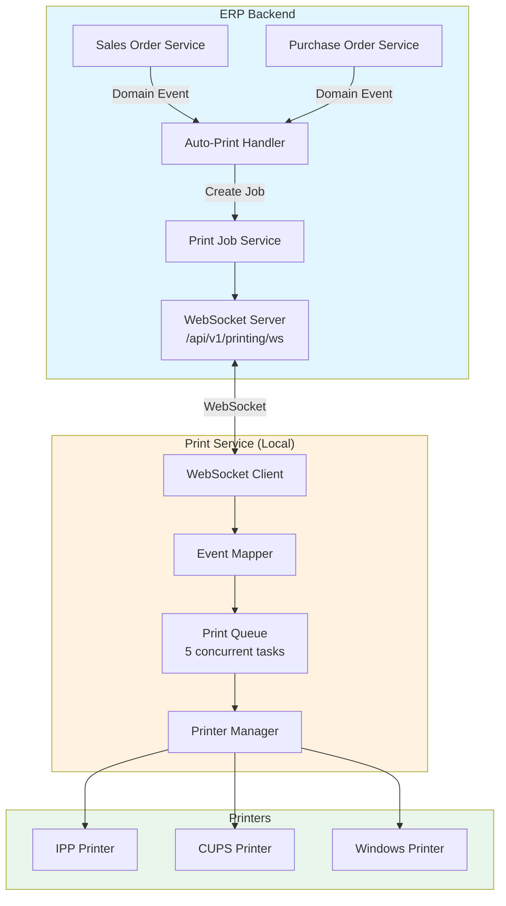
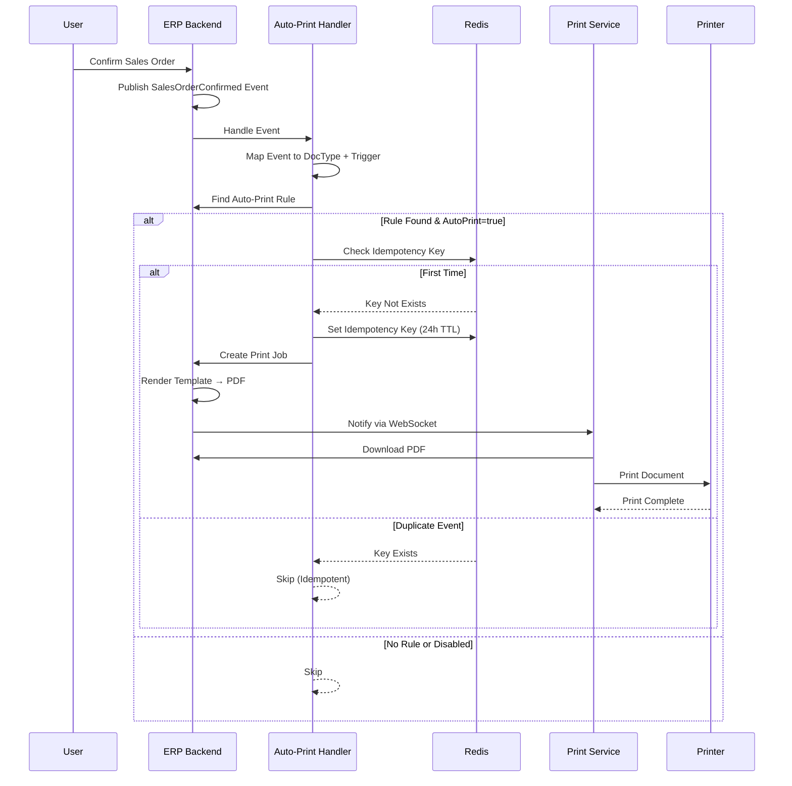
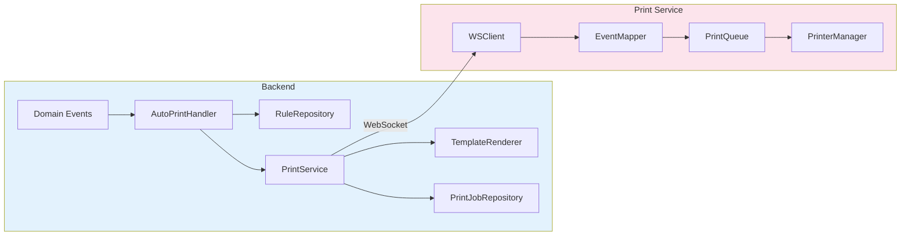
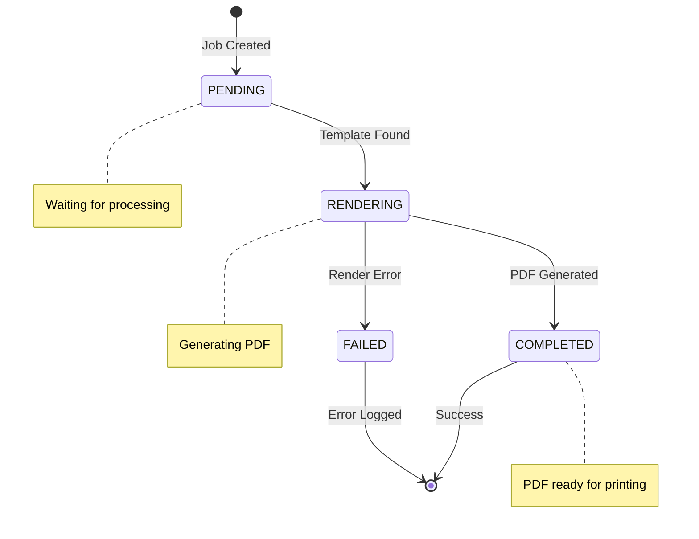

# ERP Print Service

A cross-platform print service that enables automatic document printing triggered by business events in the ERP system.

## Overview

The Print Service is a standalone application that:
- Connects to the ERP backend via WebSocket for real-time print events
- Automatically prints documents when business rules are triggered (e.g., order confirmed)
- Supports multiple printing protocols (IPP, CUPS, Windows Print Spooler)
- Provides health monitoring and logging

## System Requirements

### Supported Platforms
- **Linux**: x64 (amd64), ARM64
- **macOS**: Intel (amd64), Apple Silicon (arm64)
- **Windows**: x64 (amd64)

### Dependencies
- Network access to ERP backend API
- Printer configured on the system (CUPS on Linux/macOS, Print Spooler on Windows)

### Optional Dependencies
- **Chrome/Chromium**: Required for `chromedp` PDF renderer (default)
- **wkhtmltopdf**: Required for `wkhtmltopdf` renderer option
- **Gotenberg**: Required for `gotenberg` renderer option (self-hosted or cloud)

## Quick Start

### 1. Download

Download the appropriate binary for your platform from the releases page or build from source:

```bash
# Build for current platform
make build

# Build for all platforms
make build-all
```

### 2. Configure

Copy the example configuration and edit it:

```bash
cp configs/config.example.yaml configs/config.yaml
```

Edit `configs/config.yaml` with your settings:

```yaml
server:
  api_url: "http://your-erp-server:8080"
  websocket_url: "ws://your-erp-server:8080/api/v1/printing/ws"
  tenant_id: "your-tenant-id"
  api_token: "your-api-token"

printing:
  default_printer: "My Printer"
  protocol: ipp  # or cups, windows
```

### 3. Run

```bash
./print-service -config configs/config.yaml
```

## Installation as System Service

### Linux (systemd)

```bash
sudo ./scripts/install.sh --config /path/to/config.yaml
```

The service will:
- Install to `/opt/print-service/`
- Create a dedicated `print-service` user
- Start automatically on boot
- Restart on failures

**Management commands:**
```bash
sudo systemctl start print-service
sudo systemctl stop print-service
sudo systemctl status print-service
sudo journalctl -u print-service -f  # View logs
```

**Uninstall:**
```bash
sudo ./scripts/install.sh --uninstall
```

### macOS (launchd)

```bash
./scripts/install-mac.sh --config /path/to/config.yaml
```

For system-wide installation (requires admin privileges):
```bash
sudo ./scripts/install-mac.sh --system --config /path/to/config.yaml
```

**Management commands:**
```bash
launchctl start com.erp.print-service
launchctl stop com.erp.print-service
```

**Uninstall:**
```bash
./scripts/install-mac.sh --uninstall
```

### Windows (Windows Service)

Run PowerShell as Administrator:

```powershell
.\scripts\install.ps1 -ConfigPath C:\path\to\config.yaml
```

**Management commands:**
```powershell
Start-Service PrintService
Stop-Service PrintService
Get-Service PrintService
```

**View logs:**
```powershell
Get-EventLog -LogName Application -Source PrintService
```

**Uninstall:**
```powershell
.\scripts\install.ps1 -Uninstall
```

## Configuration Reference

### Server Settings

| Setting | Description | Default |
|---------|-------------|---------|
| `server.api_url` | ERP backend API URL | `http://localhost:8080` |
| `server.websocket_url` | WebSocket URL for print events | `ws://localhost:8080/api/v1/printing/ws` |
| `server.tenant_id` | Your tenant identifier | (required) |
| `server.api_token` | API authentication token | (required) |
| `server.timeout` | Request timeout | `30s` |
| `server.reconnect_interval` | WebSocket reconnect interval | `5s` |
| `server.max_reconnect_attempts` | Max reconnect attempts (0=unlimited) | `0` |

### Printing Settings

| Setting | Description | Default |
|---------|-------------|---------|
| `printing.default_printer` | Default printer name | System default |
| `printing.protocol` | Printing protocol (ipp/cups/windows) | `ipp` |
| `printing.ipp_server` | IPP server URL | `http://localhost:631` |
| `printing.cups_server` | CUPS server address | Local socket |
| `printing.renderer` | PDF renderer (chromedp/wkhtmltopdf/gotenberg) | `chromedp` |

### Logging Settings

| Setting | Description | Default |
|---------|-------------|---------|
| `logging.level` | Log level (debug/info/warn/error) | `info` |
| `logging.file` | Log file path (empty=stdout) | (empty) |
| `logging.max_size` | Max log file size in MB | `100` |
| `logging.max_backups` | Number of old log files to keep | `3` |
| `logging.max_age` | Max days to keep old logs | `28` |
| `logging.compress` | Compress rotated logs | `true` |

### Health Check Settings

| Setting | Description | Default |
|---------|-------------|---------|
| `health.enabled` | Enable health endpoint | `true` |
| `health.port` | Health endpoint port | `9999` |
| `health.path` | Health endpoint path | `/health` |

### Environment Variables

All settings can be overridden with environment variables using `${VAR}` syntax:

```yaml
server:
  api_token: "${PRINT_SERVICE_API_TOKEN}"
```

## Architecture

### System Architecture



### Auto-Print Flow



### Component Interaction



### Print Job States



## Supported Events

The print service listens for these domain events:

| Event | Document Type | Trigger |
|-------|---------------|---------|
| `SalesOrderConfirmed` | Sales Order | CONFIRMED |
| `SalesOrderShipped` | Sales Order | SHIPPED |
| `PurchaseOrderReceived` | Purchase Order | RECEIVED |
| `ReceiptVoucherPaid` | Receipt Voucher | PAID |
| `PaymentVoucherPaid` | Payment Voucher | PAID |

## Health Check

The service exposes a health endpoint for monitoring:

```bash
curl http://localhost:9999/health
```

Response:
```json
{
  "status": "running",
  "version": "1.0.0",
  "build_time": "2024-01-15T10:00:00Z",
  "git_commit": "abc1234",
  "uptime": "2h30m15s",
  "websocket": "connected",
  "api": "healthy",
  "printer": "available",
  "print_queue": {
    "total_tasks": 150,
    "success_count": 145,
    "failed_count": 5,
    "queue_length": 2,
    "is_running": true
  },
  "events_count": 1250,
  "printer_count": 3
}
```

## Troubleshooting

### Service won't start

1. **Check configuration**: Ensure `config.yaml` exists and is valid
   ```bash
   ./print-service -config config.yaml -validate
   ```

2. **Check permissions**: Config file should be readable (mode 600 recommended)
   ```bash
   chmod 600 config.yaml
   ```

3. **Check logs**: Look for startup errors
   ```bash
   journalctl -u print-service -n 50  # Linux
   ```

### Cannot connect to ERP backend

1. **Verify network**: Test API connectivity
   ```bash
   curl -H "Authorization: Bearer YOUR_TOKEN" http://your-erp:8080/api/v1/health
   ```

2. **Check WebSocket URL**: Ensure it matches your ERP configuration

3. **Verify credentials**: Confirm tenant ID and API token are correct

### Prints not working

1. **Check printer**: Verify printer is online
   ```bash
   lpstat -p  # Linux/macOS
   ```

2. **Check protocol**: Ensure correct protocol is configured
   - Linux/macOS with CUPS: Use `cups` or `ipp`
   - Windows: Use `windows`

3. **Check auto-print rules**: Verify rules exist in ERP for the document type

### High memory usage

1. **Check queue size**: Large queue may consume memory
2. **Check PDF renderer**: ChromeDP keeps Chrome process running
3. **Check log rotation**: Ensure logs aren't growing unbounded

## Development

### Building from Source

```bash
# Install dependencies
go mod download

# Build
make build

# Run tests
make test

# Run with race detection
make test-race
```

### Running Tests

```bash
# All tests
go test ./...

# With coverage
go test -cover ./...

# Specific package
go test ./internal/service/...
```

### Code Structure

```
tools/print-service/
├── cmd/
│   └── print-service/
│       └── main.go           # Application entry point
├── internal/
│   ├── client/               # API and WebSocket clients
│   │   ├── api.go           # REST API client
│   │   └── websocket.go     # WebSocket client
│   ├── config/               # Configuration loading
│   ├── printer/              # Printer backends
│   │   ├── cups.go          # CUPS printing
│   │   ├── ipp.go           # IPP printing
│   │   └── manager.go       # Printer manager
│   ├── renderer/             # PDF rendering
│   │   ├── chromedp.go      # Chrome-based rendering
│   │   └── wkhtmltopdf.go   # wkhtmltopdf rendering
│   └── service/              # Core service logic
│       ├── event_mapping.go  # Event to document mapping
│       ├── print_queue.go    # Print task queue
│       └── print_service.go  # Main service
├── configs/
│   └── config.example.yaml   # Example configuration
├── scripts/
│   ├── install.sh           # Linux installer
│   ├── install-mac.sh       # macOS installer
│   └── install.ps1          # Windows installer
└── Makefile                  # Build automation
```

## License

This software is proprietary to the ERP system. See LICENSE file for details.
